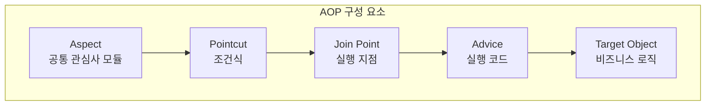
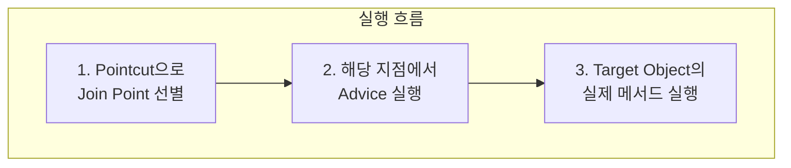
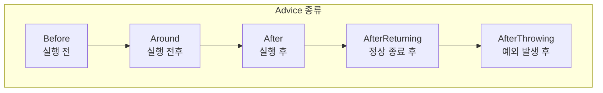
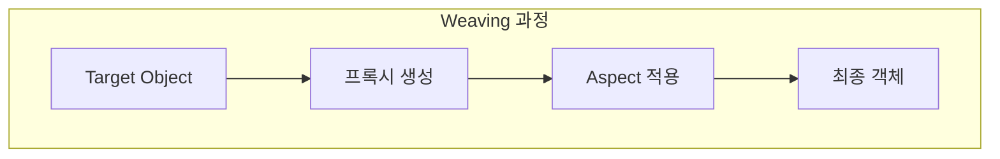
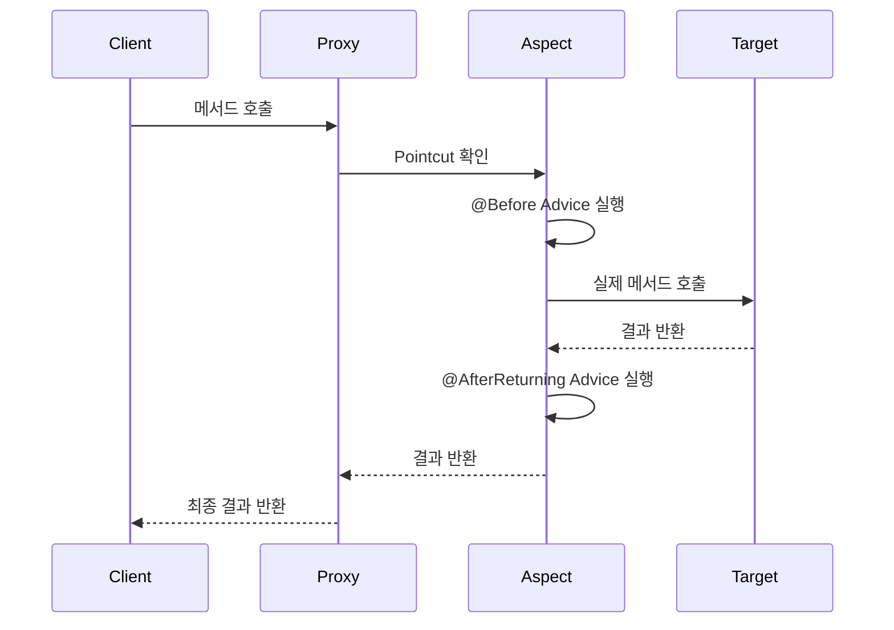
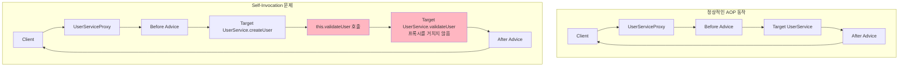
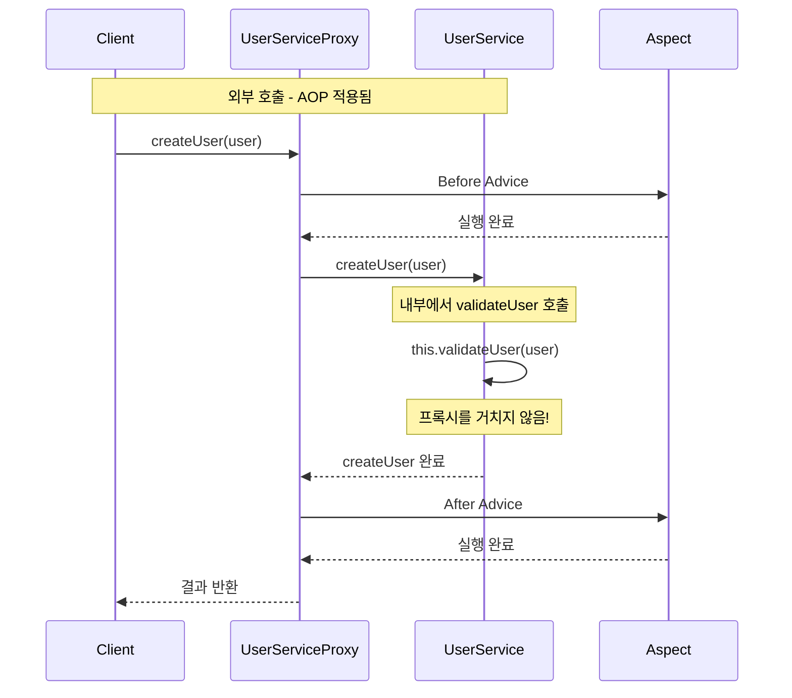
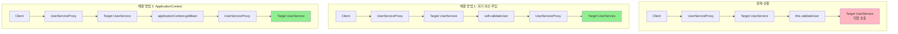

# Spring AOP(Aspect Oriented Programming) 이해하기.

## Q3. AOP에 대해서 설명하고, 사용했을때와 사용하지 않았을때의 장점, 단점등을 상세히 설명해줘

### A03. AOP (Aspect Oriented Programming) 상세 분석

#### AOP의 개념과 핵심 원리

**AOP란?**
- **관점 지향 프로그래밍**: 핵심 비즈니스 로직과 공통 관심사(Cross-cutting Concerns)를 분리하는 프로그래밍 패러다임
- **횡단 관심사**: 로깅, 트랜잭션, 보안, 예외 처리 등 여러 모듈에서 공통으로 사용되는 기능
- **핵심 관심사**: 실제 비즈니스 로직 (예: 사용자 등록, 주문 처리 등)

**핵심 용어:**
- **Aspect**: 공통 관심사를 모듈화한 것 (예: 로깅, 트랜잭션)
- **Join Point**: 프로그램 실행 중 특정 지점 (메서드 호출, 예외 발생 등)
- **Pointcut**: Join Point를 선별하는 표현식
- **Advice**: 특정 Join Point에서 실행되는 코드
- **Target Object**: Advice가 적용될 대상 객체

#### AOP 없이 개발할 때의 문제점

**1. 코드 중복 (Code Duplication)**
```java
// UserService
public class UserService {
    public void createUser(User user) {
        // 로깅 시작
        logger.info("사용자 생성 시작: " + user.getEmail());
        long startTime = System.currentTimeMillis();
        
        try {
            // 핵심 비즈니스 로직
            userRepository.save(user);
            
            // 로깅 완료
            long endTime = System.currentTimeMillis();
            logger.info("사용자 생성 완료: " + user.getEmail() + ", 소요시간: " + (endTime - startTime) + "ms");
        } catch (Exception e) {
            logger.error("사용자 생성 실패: " + e.getMessage());
            throw e;
        }
    }
    
    public void updateUser(User user) {
        // 로깅 시작 (중복 코드!)
        logger.info("사용자 수정 시작: " + user.getEmail());
        long startTime = System.currentTimeMillis();
        
        try {
            // 핵심 비즈니스 로직
            userRepository.update(user);
            
            // 로깅 완료 (중복 코드!)
            long endTime = System.currentTimeMillis();
            logger.info("사용자 수정 완료: " + user.getEmail() + ", 소요시간: " + (endTime - startTime) + "ms");
        } catch (Exception e) {
            logger.error("사용자 수정 실패: " + e.getMessage());
            throw e;
        }
    }
}

// OrderService (동일한 로깅 코드 중복)
public class OrderService {
    public void createOrder(Order order) {
        // 로깅 시작 (또 다른 중복!)
        logger.info("주문 생성 시작: " + order.getOrderId());
        long startTime = System.currentTimeMillis();
        
        try {
            // 핵심 비즈니스 로직
            orderRepository.save(order);
            
            // 로깅 완료 (또 다른 중복!)
            long endTime = System.currentTimeMillis();
            logger.info("주문 생성 완료: " + order.getOrderId() + ", 소요시간: " + (endTime - startTime) + "ms");
        } catch (Exception e) {
            logger.error("주문 생성 실패: " + e.getMessage());
            throw e;
        }
    }
}
```

**2. 관심사의 분리 실패**
- 비즈니스 로직과 공통 관심사가 섞여 있어 코드 가독성 저하
- 단일 책임 원칙(SRP) 위반
- 유지보수성 저하

**3. 변경의 어려움**
- 로깅 형식 변경 시 모든 메서드를 수정해야 함
- 새로운 공통 기능 추가 시 모든 클래스에 반복 작업

#### AOP 적용 후의 개선점

**1. 깔끔한 비즈니스 로직**
```java
@Service
public class UserService {
    private final UserRepository userRepository;
    
    public UserService(UserRepository userRepository) {
        this.userRepository = userRepository;
    }
    
    // 핵심 비즈니스 로직만 남음
    public void createUser(User user) {
        userRepository.save(user);
    }
    
    public void updateUser(User user) {
        userRepository.update(user);
    }
}

@Service
public class OrderService {
    private final OrderRepository orderRepository;
    
    public OrderService(OrderRepository orderRepository) {
        this.orderRepository = orderRepository;
    }
    
    // 핵심 비즈니스 로직만 남음
    public void createOrder(Order order) {
        orderRepository.save(order);
    }
}
```

**2. 공통 관심사의 모듈화**
```java
@Aspect
@Component
public class LoggingAspect {
    private static final Logger logger = LoggerFactory.getLogger(LoggingAspect.class);
    
    // 모든 Service 클래스의 모든 메서드에 적용
    @Around("execution(* com.example.service.*Service.*(..))")
    public Object logExecutionTime(ProceedingJoinPoint joinPoint) throws Throwable {
        String methodName = joinPoint.getSignature().getName();
        String className = joinPoint.getTarget().getClass().getSimpleName();
        
        logger.info("{} - {} 메서드 실행 시작", className, methodName);
        long startTime = System.currentTimeMillis();
        
        try {
            Object result = joinPoint.proceed(); // 실제 메서드 실행
            long endTime = System.currentTimeMillis();
            logger.info("{} - {} 메서드 실행 완료, 소요시간: {}ms", 
                       className, methodName, (endTime - startTime));
            return result;
        } catch (Exception e) {
            logger.error("{} - {} 메서드 실행 실패: {}", className, methodName, e.getMessage());
            throw e;
        }
    }
}
```

#### AOP의 다양한 활용 사례

**1. 트랜잭션 관리**
```java
@Aspect
@Component
public class TransactionAspect {
    
    @Around("@annotation(org.springframework.transaction.annotation.Transactional)")
    public Object manageTransaction(ProceedingJoinPoint joinPoint) throws Throwable {
        // 트랜잭션 시작
        TransactionStatus status = transactionManager.beginTransaction();
        
        try {
            Object result = joinPoint.proceed();
            // 트랜잭션 커밋
            transactionManager.commit(status);
            return result;
        } catch (Exception e) {
            // 트랜잭션 롤백
            transactionManager.rollback(status);
            throw e;
        }
    }
}
```

**2. 보안 검증**
```java
@Aspect
@Component
public class SecurityAspect {
    
    @Before("@annotation(secured)")
    public void checkSecurity(Secured secured) {
        // 사용자 권한 검증
        if (!hasPermission(secured.value())) {
            throw new SecurityException("권한이 없습니다.");
        }
    }
}
```

**3. 성능 모니터링**
```java
@Aspect
@Component
public class PerformanceAspect {
    
    @Around("@annotation(Monitored)")
    public Object monitorPerformance(ProceedingJoinPoint joinPoint) throws Throwable {
        long startTime = System.nanoTime();
        Object result = joinPoint.proceed();
        long endTime = System.nanoTime();
        
        // 성능 지표 수집
        recordPerformance(joinPoint.getSignature().getName(), endTime - startTime);
        return result;
    }
}
```

#### AOP 사용 시 장단점 비교

| 구분 | AOP 사용 시 | AOP 미사용 시 |
|------|-------------|---------------|
| **코드 중복** | 제거됨 | 심각한 중복 발생 |
| **관심사 분리** | 완벽한 분리 | 비즈니스 로직과 공통 관심사 혼재 |
| **유지보수성** | 높음 (공통 기능 수정 시 한 곳만 변경) | 낮음 (여러 곳 수정 필요) |
| **가독성** | 높음 (핵심 로직에 집중) | 낮음 (공통 코드로 인한 복잡성) |
| **재사용성** | 높음 (Aspect 재사용) | 낮음 (코드 복사/붙여넣기) |
| **테스트 용이성** | 높음 (Aspect 분리로 단위 테스트 쉬움) | 낮음 (공통 코드 포함으로 테스트 복잡) |
| **학습 곡선** | 있음 (AOP 개념 학습 필요) | 없음 (기존 방식) |
| **디버깅** | 복잡함 (프록시 기반) | 단순함 (직접 호출) |
| **성능** | 약간의 오버헤드 (프록시) | 오버헤드 없음 |

#### Spring AOP의 제한사항

**1. 프록시 기반의 한계**
- private 메서드에는 적용 불가
- final 클래스에는 적용 불가
- self-invocation (내부 메서드 호출)에는 적용 불가

**2. 제한된 Join Point**
- 메서드 실행에만 적용 가능
- 필드 접근, 생성자 호출 등에는 적용 불가

**3. 성능 오버헤드**
- 프록시 객체 생성으로 인한 메모리 사용량 증가
- 메서드 호출 시 프록시 체인을 통한 간접 호출

#### 실무 권장사항

**1. AOP 사용이 권장되는 경우**
- 로깅, 트랜잭션, 보안 등 공통 관심사가 많은 경우
- 여러 모듈에서 동일한 패턴이 반복되는 경우
- 비즈니스 로직과 공통 관심사를 명확히 분리하고 싶은 경우

**2. AOP 사용을 주의해야 하는 경우**
- 단순한 CRUD 작업만 있는 경우
- 성능이 매우 중요한 경우
- 팀원들이 AOP에 익숙하지 않은 경우

**3. AOP 적용 시 고려사항**
- 적절한 Pointcut 표현식 사용
- Advice의 실행 순서 고려
- 예외 처리 로직 포함
- 성능 모니터링

> **결론**: AOP는 코드의 품질과 유지보수성을 크게 향상시키지만, 적절한 사용 시점과 방법을 고려해야 합니다. 특히 공통 관심사가 많은 엔터프라이즈 애플리케이션에서는 AOP의 사용이 거의 필수적입니다.

## 04. AOP의 구성 요소에 대해서 설명하시오

### A04. AOP 구성 요소 상세 분석

#### AOP의 핵심 구성 요소

**1. Aspect (애스펙트)**
- **정의**: 공통 관심사를 모듈화한 것
- **역할**: 로깅, 트랜잭션, 보안 등 횡단 관심사를 담당
- **특징**: 
  - 하나의 관심사를 하나의 Aspect로 캡슐화
  - 여러 클래스에 걸쳐 있는 공통 기능을 모듈화
  - 재사용 가능한 모듈

```java
@Aspect
@Component
public class LoggingAspect {
    // 로깅 관련 공통 관심사
    @Around("execution(* com.example.service.*.*(..))")
    public Object logExecutionTime(ProceedingJoinPoint joinPoint) throws Throwable {
        // 로깅 로직
    }
}
```

**2. Join Point (조인 포인트)**
- **정의**: 프로그램 실행 중 특정 지점
- **종류**:
  - 메서드 호출 (Method Call)
  - 메서드 실행 (Method Execution)
  - 예외 처리 (Exception Handling)
  - 필드 접근 (Field Access)
  - 생성자 호출 (Constructor Call)

```java
// Join Point의 예시들
public class UserService {
    public void createUser(User user) {  // ← Join Point (메서드 실행)
        userRepository.save(user);       // ← Join Point (메서드 호출)
        if (user == null) {
            throw new IllegalArgumentException(); // ← Join Point (예외 처리)
        }
    }
}
```

**3. Pointcut (포인트컷)**
- **정의**: Join Point를 선별하는 표현식
- **역할**: 어떤 Join Point에 Advice를 적용할지 결정
- **표현식**: AspectJ 표현식을 사용

```java
// Pointcut 표현식 예시들
@Pointcut("execution(* com.example.service.*.*(..))")  // 모든 서비스 메서드
@Pointcut("execution(* *.*(..))")                      // 모든 메서드
@Pointcut("within(com.example.service.*)")             // 특정 패키지 내
@Pointcut("@annotation(org.springframework.transaction.annotation.Transactional)") // 특정 어노테이션
@Pointcut("args(String, int)")                         // 특정 파라미터 타입
```

**4. Advice (어드바이스)**
- **정의**: 특정 Join Point에서 실행되는 코드
- **종류**:
  - **@Before**: 메서드 실행 전
  - **@After**: 메서드 실행 후 (정상/예외 모두)
  - **@AfterReturning**: 정상 종료 후
  - **@AfterThrowing**: 예외 발생 후
  - **@Around**: 메서드 실행 전후 제어

```java
@Aspect
@Component
public class LoggingAspect {
    
    // Before Advice - 메서드 실행 전
    @Before("execution(* com.example.service.*.*(..))")
    public void beforeMethodExecution(JoinPoint joinPoint) {
        logger.info("메서드 실행 전: " + joinPoint.getSignature().getName());
    }
    
    // AfterReturning Advice - 정상 종료 후
    @AfterReturning(pointcut = "execution(* com.example.service.*.*(..))", 
                    returning = "result")
    public void afterReturning(JoinPoint joinPoint, Object result) {
        logger.info("메서드 정상 종료: " + joinPoint.getSignature().getName());
    }
    
    // AfterThrowing Advice - 예외 발생 후
    @AfterThrowing(pointcut = "execution(* com.example.service.*.*(..))", 
                   throwing = "ex")
    public void afterThrowing(JoinPoint joinPoint, Exception ex) {
        logger.error("메서드 예외 발생: " + joinPoint.getSignature().getName() + ", " + ex.getMessage());
    }
    
    // Around Advice - 메서드 실행 전후 제어
    @Around("execution(* com.example.service.*.*(..))")
    public Object aroundMethodExecution(ProceedingJoinPoint joinPoint) throws Throwable {
        logger.info("메서드 실행 시작: " + joinPoint.getSignature().getName());
        Object result = joinPoint.proceed(); // 실제 메서드 실행
        logger.info("메서드 실행 완료: " + joinPoint.getSignature().getName());
        return result;
    }
}
```

**5. Target Object (타겟 객체)**
- **정의**: Advice가 적용될 대상 객체
- **특징**: 
  - 실제 비즈니스 로직을 담당하는 객체
  - 프록시로 감싸져서 Advice가 적용됨

```java
@Service
public class UserService {  // ← Target Object
    public void createUser(User user) {
        // 실제 비즈니스 로직
        userRepository.save(user);
    }
}
```

**6. Weaving (위빙)**
- **정의**: Aspect를 Target Object에 연결하는 과정
- **종류**:
  - **Compile-time Weaving**: 컴파일 시점에 위빙
  - **Load-time Weaving**: 클래스 로딩 시점에 위빙
  - **Runtime Weaving**: 런타임에 위빙 (Spring AOP)

#### AOP 구성 요소 관계도









#### AOP 실행 과정 상세도



#### Spring AOP vs AspectJ 비교

| 구분 | Spring AOP | AspectJ |
|------|------------|---------|
| **위빙 시점** | Runtime Weaving | Compile-time, Load-time, Runtime |
| **Join Point** | 메서드 실행만 | 메서드, 생성자, 필드, 예외 등 |
| **성능** | 약간의 오버헤드 | 최적화된 성능 |
| **학습 곡선** | 쉬움 | 복잡함 |
| **제한사항** | public 메서드만 | 모든 접근 제어자 |
| **사용 시기** | 간단한 AOP | 복잡한 AOP 요구사항 |

#### 실무에서의 AOP 구성 요소 활용

**1. 로깅 Aspect**
```java
@Aspect
@Component
public class LoggingAspect {
    
    @Pointcut("execution(* com.example.service.*.*(..))")
    public void serviceMethods() {}
    
    @Around("serviceMethods()")
    public Object logExecutionTime(ProceedingJoinPoint joinPoint) throws Throwable {
        // 로깅 로직
    }
}
```

**2. 트랜잭션 Aspect**
```java
@Aspect
@Component
public class TransactionAspect {
    
    @Around("@annotation(Transactional)")
    public Object manageTransaction(ProceedingJoinPoint joinPoint) throws Throwable {
        // 트랜잭션 관리 로직
    }
}
```

**3. 보안 Aspect**
```java
@Aspect
@Component
public class SecurityAspect {
    
    @Before("@annotation(Secured)")
    public void checkSecurity(JoinPoint joinPoint) {
        // 보안 검증 로직
    }
}
```

> **결론**: AOP의 구성 요소들은 서로 유기적으로 연결되어 있으며, 각각의 역할이 명확히 분리되어 있어 유지보수성과 재사용성을 높입니다. Spring AOP에서는 이러한 구성 요소들을 활용하여 횡단 관심사를 효과적으로 모듈화할 수 있습니다.


## Q04. AOP는 프록시를 사용하고 있다. 프록시를 사용하는 경우 자기자신 클래스에서 자신의 메소드를 호출하면 왜 AOP가 걸리지 않는지 동작방식으로 그 이유를 설명하시오.

### A04. Self-Invocation 문제와 Spring AOP 동작 방식

#### Self-Invocation 문제란?

**정의:**
- 같은 클래스 내에서 자신의 메서드를 직접 호출할 때 AOP가 적용되지 않는 현상
- Spring AOP의 프록시 기반 동작 방식 때문에 발생하는 제한사항

**문제 상황:**
```java
@Service
public class UserService {
    
    public void createUser(User user) {
        // AOP가 적용됨 (외부에서 호출)
        System.out.println("사용자 생성 시작");
        validateUser(user); // AOP가 적용되지 않음 (내부 호출)
        saveUser(user);     // AOP가 적용되지 않음 (내부 호출)
    }
    
    public void validateUser(User user) {
        // 검증 로직
        System.out.println("사용자 검증");
    }
    
    public void saveUser(User user) {
        // 저장 로직
        System.out.println("사용자 저장");
    }
}
```

#### Spring AOP의 프록시 동작 방식

**1. 프록시 생성 과정**
```java
// 원본 클래스
@Service
public class UserService {
    public void createUser(User user) {
        validateUser(user);
        saveUser(user);
    }
    
    public void validateUser(User user) {
        // 검증 로직
    }
    
    public void saveUser(User user) {
        // 저장 로직
    }
}

// Spring이 생성하는 프록시 (개념적)
public class UserServiceProxy extends UserService {
    private UserService target; // 실제 UserService 객체
    private List<Aspect> aspects; // 적용할 Aspect들
    
    @Override
    public void createUser(User user) {
        // Before Advice 실행
        aspects.forEach(aspect -> aspect.beforeAdvice());
        
        // 실제 메서드 호출
        target.createUser(user);
        
        // After Advice 실행
        aspects.forEach(aspect -> aspect.afterAdvice());
    }
    
    @Override
    public void validateUser(User user) {
        // Before Advice 실행
        aspects.forEach(aspect -> aspect.beforeAdvice());
        
        // 실제 메서드 호출
        target.validateUser(user);
        
        // After Advice 실행
        aspects.forEach(aspect -> aspect.afterAdvice());
    }
    
    @Override
    public void saveUser(User user) {
        // Before Advice 실행
        aspects.forEach(aspect -> aspect.beforeAdvice());
        
        // 실제 메서드 호출
        target.saveUser(user);
        
        // After Advice 실행
        aspects.forEach(aspect -> aspect.afterAdvice());
    }
}
```

**2. Self-Invocation 문제의 원인**



#### 상세 동작 과정 분석

**1. 외부에서의 메서드 호출 (AOP 적용됨)**
```java
// 외부에서 호출하는 경우
@Autowired
private UserService userService; // 실제로는 UserServiceProxy

userService.createUser(user); // 프록시를 통해 호출
```

**실행 흐름:**
1. Client → UserServiceProxy.createUser() 호출
2. UserServiceProxy에서 Before Advice 실행
3. UserServiceProxy → Target UserService.createUser() 호출
4. Target UserService.createUser() 실행
5. UserServiceProxy에서 After Advice 실행
6. 결과 반환

**2. 내부에서의 메서드 호출 (AOP 적용되지 않음)**
```java
// UserService 내부에서 호출하는 경우
public void createUser(User user) {
    this.validateUser(user); // this를 통한 직접 호출
    this.saveUser(user);     // this를 통한 직접 호출
}
```

**실행 흐름:**
1. Client → UserServiceProxy.createUser() 호출
2. UserServiceProxy에서 Before Advice 실행
3. UserServiceProxy → Target UserService.createUser() 호출
4. **Target UserService 내부에서 this.validateUser() 직접 호출**
5. **프록시를 거치지 않고 Target UserService.validateUser() 직접 실행**
6. UserServiceProxy에서 After Advice 실행
7. 결과 반환

#### Self-Invocation 문제 시각화



#### Self-Invocation 문제의 구체적 예시

**문제가 발생하는 코드:**
```java
@Service
public class UserService {
    
    @Transactional
    public void createUser(User user) {
        System.out.println("createUser 시작");
        validateUser(user); // @Transactional 적용되지 않음
        saveUser(user);     // @Transactional 적용되지 않음
        System.out.println("createUser 완료");
    }
    
    @Transactional
    public void validateUser(User user) {
        System.out.println("validateUser 실행");
        // 검증 로직
    }
    
    @Transactional
    public void saveUser(User user) {
        System.out.println("saveUser 실행");
        // 저장 로직
    }
}

// 실행 결과:
// createUser 시작
// validateUser 실행  ← 트랜잭션 없이 실행
// saveUser 실행      ← 트랜잭션 없이 실행
// createUser 완료
```

#### Self-Invocation 문제 해결 방법

**1. 자기 자신을 주입받아 사용**
```java
@Service
public class UserService {
    
    @Autowired
    private UserService self; // 자기 자신을 주입받음
    
    @Transactional
    public void createUser(User user) {
        System.out.println("createUser 시작");
        self.validateUser(user); // 프록시를 통해 호출
        self.saveUser(user);     // 프록시를 통해 호출
        System.out.println("createUser 완료");
    }
    
    @Transactional
    public void validateUser(User user) {
        System.out.println("validateUser 실행");
        // 검증 로직
    }
    
    @Transactional
    public void saveUser(User user) {
        System.out.println("saveUser 실행");
        // 저장 로직
    }
}
```

**2. ApplicationContext를 통한 자기 자신 조회**
```java
@Service
public class UserService {
    
    @Autowired
    private ApplicationContext applicationContext;
    
    @Transactional
    public void createUser(User user) {
        System.out.println("createUser 시작");
        
        UserService self = applicationContext.getBean(UserService.class);
        self.validateUser(user); // 프록시를 통해 호출
        self.saveUser(user);     // 프록시를 통해 호출
        
        System.out.println("createUser 완료");
    }
    
    @Transactional
    public void validateUser(User user) {
        System.out.println("validateUser 실행");
        // 검증 로직
    }
    
    @Transactional
    public void saveUser(User user) {
        System.out.println("saveUser 실행");
        // 저장 로직
    }
}
```

**3. AopContext를 사용한 현재 프록시 조회**
```java
@Service
public class UserService {
    
    @Transactional
    public void createUser(User user) {
        System.out.println("createUser 시작");
        
        UserService self = (UserService) AopContext.currentProxy();
        self.validateUser(user); // 프록시를 통해 호출
        self.saveUser(user);     // 프록시를 통해 호출
        
        System.out.println("createUser 완료");
    }
    
    @Transactional
    public void validateUser(User user) {
        System.out.println("validateUser 실행");
        // 검증 로직
    }
    
    @Transactional
    public void saveUser(User user) {
        System.out.println("saveUser 실행");
        // 저장 로직
    }
}

// AopContext 사용을 위한 설정
@Configuration
@EnableAspectJAutoProxy(proxyTargetClass = true, exposeProxy = true)
public class AopConfig {
}
```

#### 해결 방법 비교

| 방법 | 장점 | 단점 | 권장도 |
|------|------|------|--------|
| **자기 자신 주입** | 간단함, Spring 권장 | 순환 참조 가능성 | ★★★ |
| **ApplicationContext 사용** | 명확함 | 코드 복잡성 | ★★ |
| **AopContext 사용** | 가장 직접적 | 설정 필요, Spring 특화 | ★★ |

#### Self-Invocation 문제 해결 다이어그램



#### 실무 권장사항

**1. Self-Invocation 문제 예방**
- 클래스 설계 시 책임 분리 고려
- AOP가 필요한 메서드는 별도 클래스로 분리
- 내부 호출보다는 외부 호출 구조 설계

**2. 해결 방법 선택 기준**
- **간단한 경우**: 자기 자신 주입
- **복잡한 경우**: ApplicationContext 사용
- **Spring 특화**: AopContext 사용

**3. 주의사항**
- 순환 참조 주의
- 성능 오버헤드 고려
- 코드 가독성 유지

> **결론**: Self-Invocation 문제는 Spring AOP의 프록시 기반 동작 방식 때문에 발생합니다. this를 통한 직접 호출은 프록시를 거치지 않아 AOP가 적용되지 않습니다. 이를 해결하기 위해서는 프록시를 통한 호출이 필요하며, 자기 자신을 주입받아 사용하는 방법이 가장 권장됩니다.
