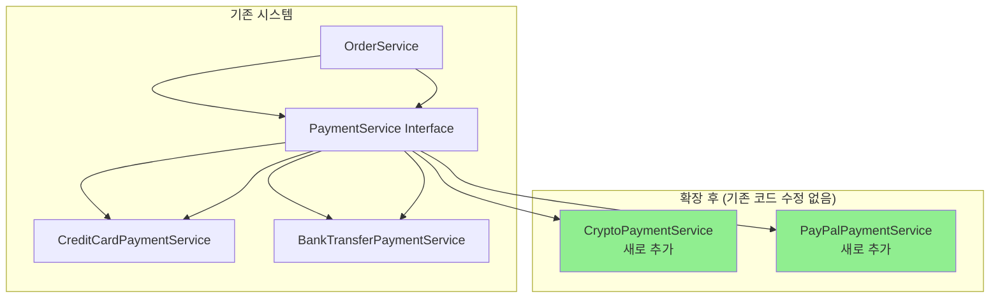
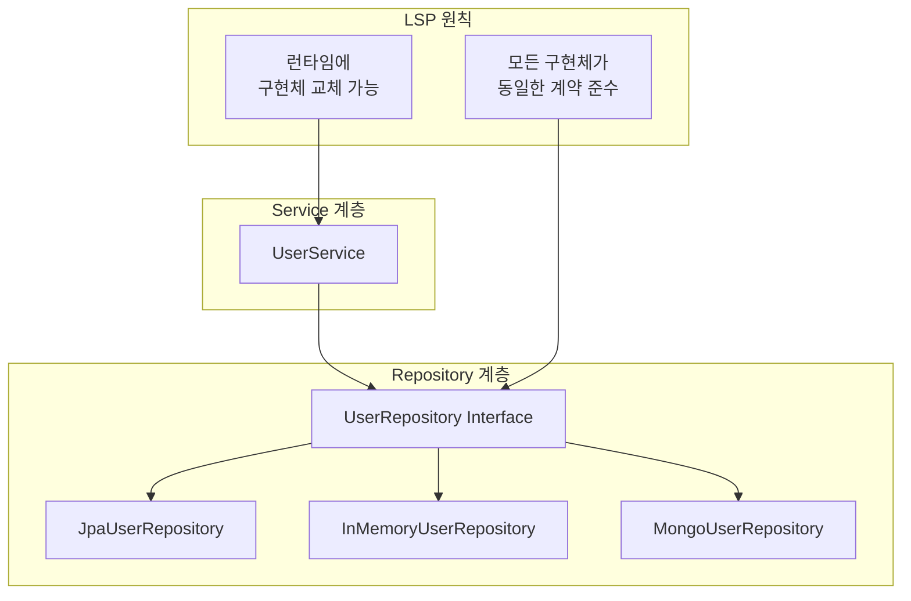
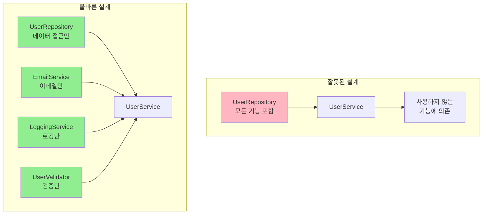
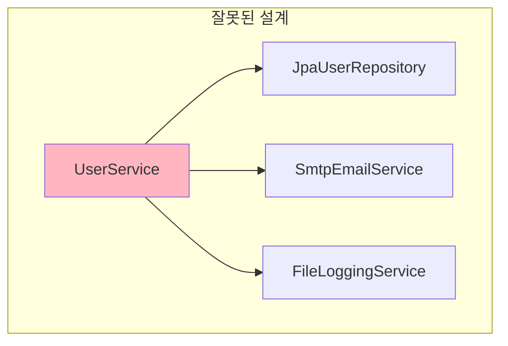
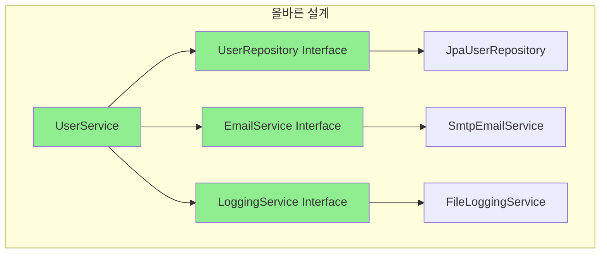
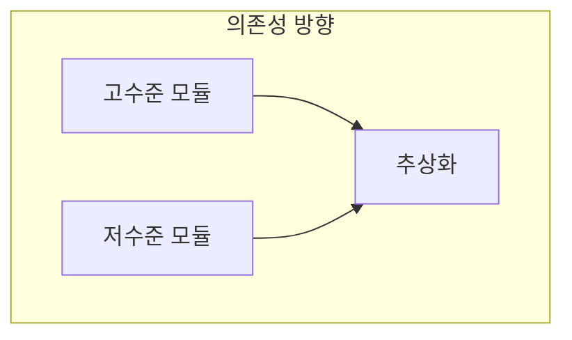

# Clean Coders 요소를 스프링에서 찾아보기

## Q06. Clean Coders (Robert C. Martin 저) 에나오는 SOLID 원칙을 지키는 스프링부트 요소를 설명하시오

### A. SOLID 원칙과 Spring Boot 구현 사례

#### SOLID 원칙 개요

**SOLID 원칙이란?**
- 로버트 C. 마틴(Robert C. Martin)이 제안한 객체 지향 설계의 5가지 기본 원칙
- 유지보수성과 확장성을 높이기 위한 설계 가이드라인
- 각 원칙의 첫 글자를 따서 SOLID라고 명명

**SOLID 원칙의 목적:**
- 코드의 재사용성 향상
- 유지보수성 개선
- 확장성 확보
- 테스트 용이성 증가
- 의존성 관리 개선

---

#### 1. S - Single Responsibility Principle (단일 책임 원칙)

**개념:**
- 하나의 클래스는 하나의 책임만 가져야 한다
- 클래스가 변경되는 이유는 오직 하나여야 한다

**Spring Boot에서의 구현:**

**1.1. @Service 어노테이션을 통한 책임 분리**
```java
// 잘못된 예시 - 여러 책임을 가진 클래스
@Service
public class UserService {
    public void createUser(User user) {
        // 사용자 생성 로직
        validateUser(user);
        encryptPassword(user);
        saveUser(user);
        sendEmail(user);
        logUserCreation(user);
    }
    
    private void validateUser(User user) { /* 검증 로직 */ }
    private void encryptPassword(User user) { /* 암호화 로직 */ }
    private void saveUser(User user) { /* 저장 로직 */ }
    private void sendEmail(User user) { /* 이메일 발송 로직 */ }
    private void logUserCreation(User user) { /* 로깅 로직 */ }
}

// 올바른 예시 - 책임 분리
@Service
public class UserService {
    private final UserRepository userRepository;
    private final PasswordEncoder passwordEncoder;
    private final EmailService emailService;
    private final LoggingService loggingService;
    
    public void createUser(User user) {
        userRepository.save(user);
    }
}

@Component
public class PasswordEncoder {
    public String encode(String password) { /* 암호화 로직 */ }
}

@Service
public class EmailService {
    public void sendWelcomeEmail(User user) { /* 이메일 발송 로직 */ }
}

@Service
public class LoggingService {
    public void logUserCreation(User user) { /* 로깅 로직 */ }
}
```

**1.2. @Component 어노테이션을 통한 기능별 분리**
```java
@Component
public class UserValidator {
    public void validate(User user) {
        // 사용자 검증 로직만 담당
    }
}

@Component
public class UserRepository {
    public void save(User user) {
        // 데이터 저장 로직만 담당
    }
}
```

**SRP 위반 시 문제점:**
- 클래스가 여러 이유로 변경됨
- 다른 기능 수정 시 영향도가 높음
- 테스트가 복잡해짐
- 재사용성이 떨어짐

---

#### 2. O - Open/Closed Principle (개방-폐쇄 원칙)

**개념:**
- 확장에는 열려있고, 수정에는 닫혀있어야 한다
- 새로운 기능을 추가할 때 기존 코드를 수정하지 않아야 한다

**Spring Boot에서의 구현:**

**2.1. 인터페이스와 다형성을 통한 확장**
```java
// 인터페이스 정의
public interface PaymentService {
    void processPayment(PaymentRequest request);
}

// 구현체들
@Service
public class CreditCardPaymentService implements PaymentService {
    @Override
    public void processPayment(PaymentRequest request) {
        // 신용카드 결제 로직
    }
}

@Service
public class BankTransferPaymentService implements PaymentService {
    @Override
    public void processPayment(PaymentRequest request) {
        // 계좌이체 로직
    }
}

@Service
public class CryptoPaymentService implements PaymentService {
    @Override
    public void processPayment(PaymentRequest request) {
        // 암호화폐 결제 로직
    }
}

// 사용하는 클래스
@Service
public class OrderService {
    private final List<PaymentService> paymentServices;
    
    public OrderService(List<PaymentService> paymentServices) {
        this.paymentServices = paymentServices;
    }
    
    public void processOrder(Order order) {
        // 새로운 결제 방식 추가 시 이 클래스는 수정하지 않음
        PaymentService paymentService = findPaymentService(order.getPaymentType());
        paymentService.processPayment(order.getPaymentRequest());
    }
}
```

**2.2. @Conditional 어노테이션을 통한 조건부 빈 등록**
```java
@Configuration
public class PaymentConfig {
    
    @Bean
    @ConditionalOnProperty(name = "payment.type", havingValue = "credit-card")
    public PaymentService creditCardPaymentService() {
        return new CreditCardPaymentService();
    }
    
    @Bean
    @ConditionalOnProperty(name = "payment.type", havingValue = "bank-transfer")
    public PaymentService bankTransferPaymentService() {
        return new BankTransferPaymentService();
    }
}
```

**OCP 다이어그램:**


---

#### 3. L - Liskov Substitution Principle (리스코프 치환 원칙)

**개념:**
- 하위 타입은 상위 타입을 대체할 수 있어야 한다
- 상속받은 클래스는 부모 클래스의 계약을 위반하지 않아야 한다

**Spring Boot에서의 구현:**

**3.1. Repository 패턴에서의 LSP**
```java
// 기본 Repository 인터페이스
public interface UserRepository {
    User save(User user);
    User findById(Long id);
    List<User> findAll();
    void deleteById(Long id);
}

// 메모리 구현체
@Repository
public class InMemoryUserRepository implements UserRepository {
    private Map<Long, User> users = new HashMap<>();
    
    @Override
    public User save(User user) {
        users.put(user.getId(), user);
        return user;
    }
    
    @Override
    public User findById(Long id) {
        return users.get(id);
    }
    
    @Override
    public List<User> findAll() {
        return new ArrayList<>(users.values());
    }
    
    @Override
    public void deleteById(Long id) {
        users.remove(id);
    }
}

// JPA 구현체
@Repository
public class JpaUserRepository implements UserRepository {
    private final UserJpaRepository jpaRepository;
    
    @Override
    public User save(User user) {
        return jpaRepository.save(user);
    }
    
    @Override
    public User findById(Long id) {
        return jpaRepository.findById(id).orElse(null);
    }
    
    @Override
    public List<User> findAll() {
        return jpaRepository.findAll();
    }
    
    @Override
    public void deleteById(Long id) {
        jpaRepository.deleteById(id);
    }
}

// 사용하는 서비스
@Service
public class UserService {
    private final UserRepository userRepository; // 어떤 구현체든 사용 가능
    
    public UserService(UserRepository userRepository) {
        this.userRepository = userRepository;
    }
    
    public User createUser(User user) {
        return userRepository.save(user);
    }
}
```

**3.2. @Qualifier를 통한 명시적 구현체 선택**
```java
@Configuration
public class RepositoryConfig {
    
    @Bean
    @Primary
    public UserRepository jpaUserRepository() {
        return new JpaUserRepository();
    }
    
    @Bean
    @Qualifier("memory")
    public UserRepository inMemoryUserRepository() {
        return new InMemoryUserRepository();
    }
}

@Service
public class TestUserService {
    private final UserRepository userRepository;
    
    public TestUserService(@Qualifier("memory") UserRepository userRepository) {
        this.userRepository = userRepository; // 테스트용 메모리 구현체 사용
    }
}
```

**LSP 다이어그램:**


---

#### 4. I - Interface Segregation Principle (인터페이스 분리 원칙)

**개념:**
- 클라이언트는 자신이 사용하지 않는 인터페이스에 의존하지 않아야 한다
- 큰 인터페이스보다는 작고 구체적인 인터페이스가 좋다

**Spring Boot에서의 구현:**

**4.1. 기능별 인터페이스 분리**
```java
// 잘못된 예시 - 하나의 큰 인터페이스
public interface UserRepository {
    User save(User user);
    User findById(Long id);
    List<User> findAll();
    void deleteById(Long id);
    void sendEmail(User user);
    void logUserActivity(User user);
    void validateUser(User user);
}

// 올바른 예시 - 기능별 인터페이스 분리
public interface UserRepository {
    User save(User user);
    User findById(Long id);
    List<User> findAll();
    void deleteById(Long id);
}

public interface EmailService {
    void sendEmail(User user);
}

public interface LoggingService {
    void logUserActivity(User user);
}

public interface UserValidator {
    void validateUser(User user);
}

// 구체적인 구현체들
@Repository
public class JpaUserRepository implements UserRepository {
    // 데이터 접근 로직만 구현
}

@Service
public class EmailServiceImpl implements EmailService {
    // 이메일 발송 로직만 구현
}

@Service
public class LoggingServiceImpl implements LoggingService {
    // 로깅 로직만 구현
}

@Component
public class UserValidatorImpl implements UserValidator {
    // 검증 로직만 구현
}
```

**4.2. @FunctionalInterface를 통한 단일 메서드 인터페이스**
```java
@FunctionalInterface
public interface UserProcessor {
    void process(User user);
}

@FunctionalInterface
public interface UserValidator {
    boolean isValid(User user);
}

@FunctionalInterface
public interface UserTransformer {
    User transform(User user);
}

// 사용 예시
@Service
public class UserService {
    private final List<UserProcessor> processors;
    private final List<UserValidator> validators;
    private final List<UserTransformer> transformers;
    
    public void processUser(User user) {
        // 검증
        validators.forEach(validator -> {
            if (!validator.isValid(user)) {
                throw new ValidationException();
            }
        });
        
        // 변환
        User transformedUser = user;
        for (UserTransformer transformer : transformers) {
            transformedUser = transformer.transform(transformedUser);
        }
        
        // 처리
        processors.forEach(processor -> processor.process(transformedUser));
    }
}
```

**ISP 다이어그램:**


---

#### 5. D - Dependency Inversion Principle (의존성 역전 원칙)

**개념:**
- 고수준 모듈은 저수준 모듈에 의존하지 않아야 한다
- 둘 다 추상화에 의존해야 한다
- 추상화는 세부사항에 의존하지 않아야 한다

**Spring Boot에서의 구현:**

**5.1. 의존성 주입을 통한 역전**
```java
// 고수준 모듈 (비즈니스 로직)
@Service
public class UserService {
    private final UserRepository userRepository; // 추상화에 의존
    private final EmailService emailService;     // 추상화에 의존
    private final LoggingService loggingService; // 추상화에 의존
    
    public UserService(UserRepository userRepository, 
                      EmailService emailService, 
                      LoggingService loggingService) {
        this.userRepository = userRepository;
        this.emailService = emailService;
        this.loggingService = loggingService;
    }
    
    public void createUser(User user) {
        userRepository.save(user);
        emailService.sendWelcomeEmail(user);
        loggingService.logUserCreation(user);
    }
}

// 추상화 (인터페이스)
public interface UserRepository {
    User save(User user);
}

public interface EmailService {
    void sendWelcomeEmail(User user);
}

public interface LoggingService {
    void logUserCreation(User user);
}

// 저수준 모듈 (구체적 구현)
@Repository
public class JpaUserRepository implements UserRepository {
    @Override
    public User save(User user) {
        // JPA를 사용한 데이터 저장
    }
}

@Service
public class SmtpEmailService implements EmailService {
    @Override
    public void sendWelcomeEmail(User user) {
        // SMTP를 사용한 이메일 발송
    }
}

@Service
public class FileLoggingService implements LoggingService {
    @Override
    public void logUserCreation(User user) {
        // 파일에 로그 기록
    }
}
```

**5.2. @Configuration을 통한 의존성 설정**
```java
@Configuration
public class AppConfig {
    
    @Bean
    public UserRepository userRepository() {
        return new JpaUserRepository();
    }
    
    @Bean
    public EmailService emailService() {
        return new SmtpEmailService();
    }
    
    @Bean
    public LoggingService loggingService() {
        return new FileLoggingService();
    }
    
    @Bean
    public UserService userService(UserRepository userRepository,
                                 EmailService emailService,
                                 LoggingService loggingService) {
        return new UserService(userRepository, emailService, loggingService);
    }
}
```

**DIP 다이어그램:**




---

#### Spring Boot의 SOLID 원칙 구현 요약

| 원칙 | Spring Boot 구현 요소 | 장점 |
|------|---------------------|------|
| **SRP** | @Service, @Component, @Repository | 책임 분리, 테스트 용이성 |
| **OCP** | 인터페이스, @Conditional, 다형성 | 확장성, 기존 코드 보호 |
| **LSP** | Repository 패턴, @Primary, @Qualifier | 구현체 교체 용이성 |
| **ISP** | @FunctionalInterface, 기능별 인터페이스 | 의존성 최소화 |
| **DIP** | DI Container, @Autowired, 인터페이스 | 결합도 감소, 유연성 |

#### 실무 적용 가이드

**1. SOLID 원칙 적용 시 고려사항**
- 과도한 추상화는 복잡성을 증가시킬 수 있음
- 프로젝트 규모에 맞는 적절한 수준의 설계 필요
- 팀원들의 이해도와 유지보수 능력 고려

**2. Spring Boot에서 SOLID 원칙 활용 팁**
- @Component, @Service, @Repository를 적절히 활용
- 인터페이스 설계 시 ISP 원칙 준수
- 의존성 주입을 통한 DIP 원칙 실현
- 테스트 용이성을 고려한 설계

> **결론**: Spring Boot는 SOLID 원칙을 자연스럽게 구현할 수 있는 프레임워크입니다. 각 원칙을 이해하고 적절히 적용하면 유지보수성과 확장성이 높은 애플리케이션을 개발할 수 있습니다.
