# SpringFramework와 SpringBoot 에 대해서 이해하기

## Q01. SpringFramework와 SpringBoot 의 차이점 설명 

### 01. Spring Framework vs Spring Boot 상세 비교

#### 기본 개념과 정의

**Spring Framework:**
- 자바 플랫폼을 위한 오픈소스 애플리케이션 프레임워크
- 엔터프라이즈급 애플리케이션 개발을 위한 종합적인 프로그래밍 및 구성 모델 제공
- IoC(Inversion of Control)와 DI(Dependency Injection)를 핵심으로 하는 프레임워크

**Spring Boot:**
- Spring Framework 기반의 자동 구성(Auto-Configuration) 기능을 제공하는 프레임워크
- 독립 실행형(Stand-alone) 애플리케이션 개발을 위한 도구
- 최소한의 설정으로 Spring 애플리케이션을 빠르게 시작할 수 있도록 설계

---

#### 1. 설정(Configuration) 차이점

**Spring Framework 설정:**
```xml
<!-- web.xml -->
<web-app>
    <servlet>
        <servlet-name>dispatcher</servlet-name>
        <servlet-class>org.springframework.web.servlet.DispatcherServlet</servlet-class>
        <load-on-startup>1</load-on-startup>
    </servlet>
    
    <servlet-mapping>
        <servlet-name>dispatcher</servlet-name>
        <url-pattern>/</url-pattern>
    </servlet-mapping>
</web-app>

<!-- applicationContext.xml -->
<beans xmlns="http://www.springframework.org/schema/beans"
       xmlns:xsi="http://www.w3.org/2001/XMLSchema-instance"
       xsi:schemaLocation="http://www.springframework.org/schema/beans
       http://www.springframework.org/schema/beans/spring-beans.xsd">
    
    <bean id="userService" class="com.example.service.UserService">
        <property name="userRepository" ref="userRepository"/>
    </bean>
    
    <bean id="userRepository" class="com.example.repository.UserRepository"/>
</beans>

<!-- dispatcher-servlet.xml -->
<beans xmlns="http://www.springframework.org/schema/beans"
       xmlns:mvc="http://www.springframework.org/schema/mvc"
       xmlns:context="http://www.springframework.org/schema/context"
       xsi:schemaLocation="...">
    
    <context:component-scan base-package="com.example"/>
    <mvc:annotation-driven/>
    <mvc:resources mapping="/resources/**" location="/resources/"/>
</beans>
```

**Spring Boot 설정:**
```java
// application.properties 또는 application.yml
spring.datasource.url=jdbc:h2:mem:testdb
spring.datasource.driver-class-name=org.h2.Driver
spring.jpa.hibernate.ddl-auto=create-drop
spring.jpa.show-sql=true

// 또는 Java Configuration
@Configuration
@EnableWebMvc
@ComponentScan("com.example")
public class WebConfig {
    // 최소한의 설정만 필요
}
```

**설정 복잡도 비교:**
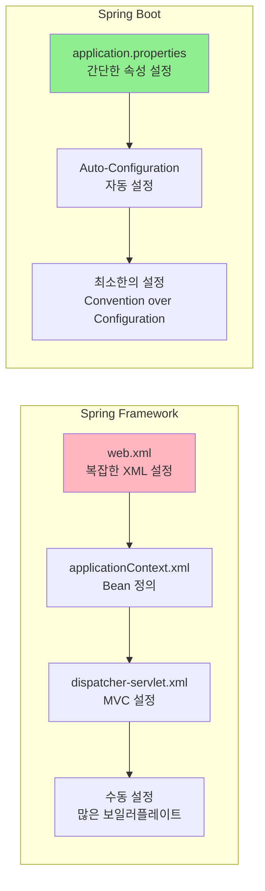

---

#### 2. 의존성 관리 차이점

**Spring Framework 의존성 관리:**
```xml
<!-- pom.xml -->
<dependencies>
    <!-- Spring Core -->
    <dependency>
        <groupId>org.springframework</groupId>
        <artifactId>spring-core</artifactId>
        <version>5.3.20</version>
    </dependency>
    
    <!-- Spring Context -->
    <dependency>
        <groupId>org.springframework</groupId>
        <artifactId>spring-context</artifactId>
        <version>5.3.20</version>
    </dependency>
    
    <!-- Spring Web MVC -->
    <dependency>
        <groupId>org.springframework</groupId>
        <artifactId>spring-webmvc</artifactId>
        <version>5.3.20</version>
    </dependency>
    
    <!-- Spring JDBC -->
    <dependency>
        <groupId>org.springframework</groupId>
        <artifactId>spring-jdbc</artifactId>
        <version>5.3.20</version>
    </dependency>
    
    <!-- Hibernate -->
    <dependency>
        <groupId>org.hibernate</groupId>
        <artifactId>hibernate-core</artifactId>
        <version>5.6.9.Final</version>
    </dependency>
    
    <!-- MySQL Connector -->
    <dependency>
        <groupId>mysql</groupId>
        <artifactId>mysql-connector-java</artifactId>
        <version>8.0.28</version>
    </dependency>
    
    <!-- Servlet API -->
    <dependency>
        <groupId>javax.servlet</groupId>
        <artifactId>javax.servlet-api</artifactId>
        <version>4.0.1</version>
        <scope>provided</scope>
    </dependency>
</dependencies>
```

**Spring Boot 의존성 관리:**
```xml
<!-- pom.xml -->
<parent>
    <groupId>org.springframework.boot</groupId>
    <artifactId>spring-boot-starter-parent</artifactId>
    <version>2.7.0</version>
</parent>

<dependencies>
    <!-- Spring Boot Starter Web -->
    <dependency>
        <groupId>org.springframework.boot</groupId>
        <artifactId>spring-boot-starter-web</artifactId>
    </dependency>
    
    <!-- Spring Boot Starter Data JPA -->
    <dependency>
        <groupId>org.springframework.boot</groupId>
        <artifactId>spring-boot-starter-data-jpa</artifactId>
    </dependency>
    
    <!-- H2 Database -->
    <dependency>
        <groupId>com.h2database</groupId>
        <artifactId>h2</artifactId>
        <scope>runtime</scope>
    </dependency>
</dependencies>
```

**의존성 관리 비교 다이어그램:**
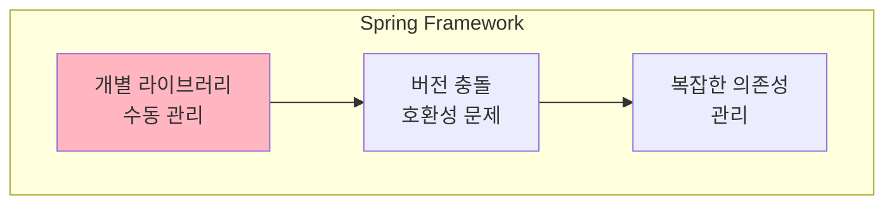

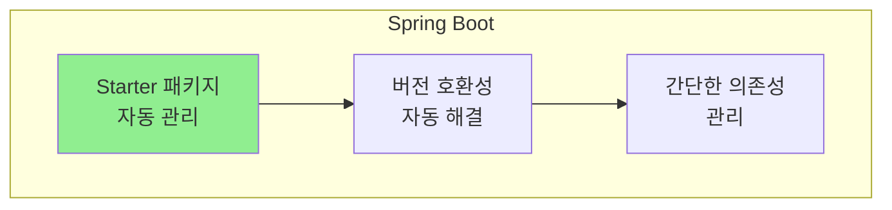

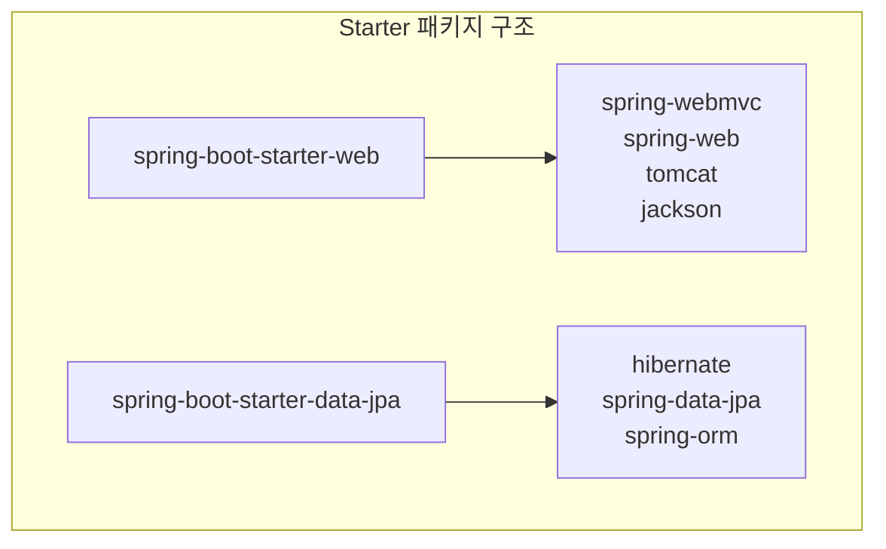

---

#### 3. 애플리케이션 시작 방식 차이점

**Spring Framework 시작:**
```java
// 1. web.xml 기반 설정
// 2. 서버 배포 필요 (WAR 파일)
// 3. 외부 서버(Tomcat, JBoss 등) 필요

// Main 클래스 (별도 필요 없음)
public class Main {
    public static void main(String[] args) {
        // Spring Framework는 별도 Main 클래스 불필요
        // 웹 애플리케이션은 서버에 배포하여 실행
    }
}

// 배포 과정
// 1. mvn clean package
// 2. target/application.war 생성
// 3. Tomcat/webapps/ 폴더에 배포
// 4. Tomcat 시작
// 5. http://localhost:8080/application 접속
```

**Spring Boot 시작:**
```java
@SpringBootApplication
public class Application {
    public static void main(String[] args) {
        SpringApplication.run(Application.class, args);
    }
}

// 실행 과정
// 1. java -jar application.jar
// 2. 내장 톰캣 자동 시작
// 3. http://localhost:8080 접속
```

**애플리케이션 시작 방식 비교:**
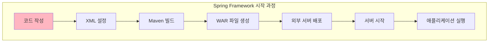

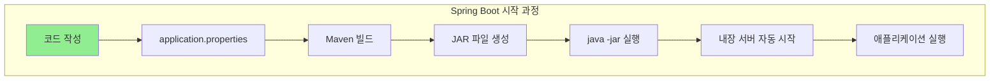

---

#### 4. Auto-Configuration vs Manual Configuration

**Spring Framework Manual Configuration:**
```java
// 1. DataSource 설정
@Configuration
public class DatabaseConfig {
    
    @Bean
    public DataSource dataSource() {
        DriverManagerDataSource dataSource = new DriverManagerDataSource();
        dataSource.setDriverClassName("com.mysql.cj.jdbc.Driver");
        dataSource.setUrl("jdbc:mysql://localhost:3306/testdb");
        dataSource.setUsername("root");
        dataSource.setPassword("password");
        return dataSource;
    }
    
    @Bean
    public LocalSessionFactoryBean sessionFactory() {
        LocalSessionFactoryBean sessionFactory = new LocalSessionFactoryBean();
        sessionFactory.setDataSource(dataSource());
        sessionFactory.setPackagesToScan("com.example.entity");
        sessionFactory.setHibernateProperties(hibernateProperties());
        return sessionFactory;
    }
    
    @Bean
    public HibernateTransactionManager transactionManager() {
        HibernateTransactionManager transactionManager = new HibernateTransactionManager();
        transactionManager.setSessionFactory(sessionFactory().getObject());
        return transactionManager;
    }
    
    private Properties hibernateProperties() {
        Properties properties = new Properties();
        properties.put("hibernate.dialect", "org.hibernate.dialect.MySQL8Dialect");
        properties.put("hibernate.show_sql", "true");
        properties.put("hibernate.hbm2ddl.auto", "create-drop");
        return properties;
    }
}

// 2. Web MVC 설정
@Configuration
@EnableWebMvc
public class WebConfig implements WebMvcConfigurer {
    
    @Override
    public void addResourceHandlers(ResourceHandlerRegistry registry) {
        registry.addResourceHandler("/static/**")
                .addResourceLocations("/static/");
    }
    
    @Bean
    public ViewResolver viewResolver() {
        InternalResourceViewResolver resolver = new InternalResourceViewResolver();
        resolver.setPrefix("/WEB-INF/views/");
        resolver.setSuffix(".jsp");
        return resolver;
    }
}
```

**Spring Boot Auto-Configuration:**
```java
// 1. 최소한의 설정만 필요
@SpringBootApplication
public class Application {
    public static void main(String[] args) {
        SpringApplication.run(Application.class, args);
    }
}

// 2. application.properties만으로 설정
spring.datasource.url=jdbc:mysql://localhost:3306/testdb
spring.datasource.username=root
spring.datasource.password=password
spring.jpa.hibernate.ddl-auto=create-drop
spring.jpa.show-sql=true

// 3. 필요시에만 추가 설정
@Configuration
public class CustomConfig {
    // 커스텀 설정만 추가
}
```

**Auto-Configuration 동작 방식:**
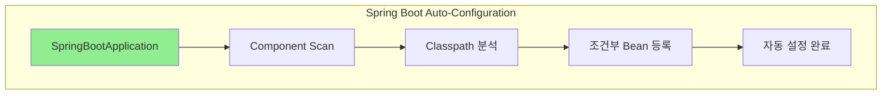

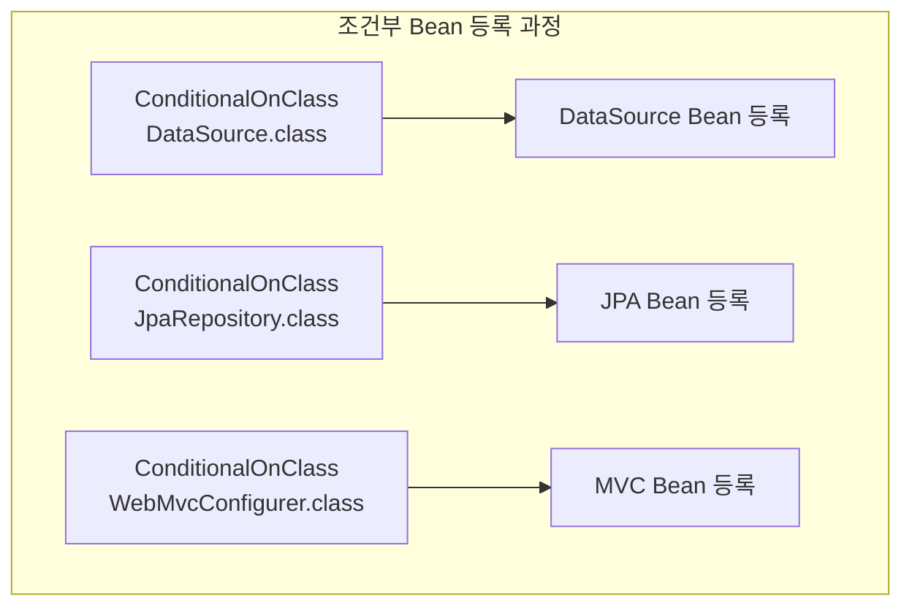


---

#### 5. 개발 생산성 비교

**Spring Framework 개발 과정:**
```java
// 1. 프로젝트 구조 설정
src/
├── main/
│   ├── java/
│   │   └── com/example/
│   │       ├── controller/
│   │       ├── service/
│   │       ├── repository/
│   │       └── entity/
│   ├── resources/
│   │   ├── applicationContext.xml
│   │   └── database.properties
│   └── webapp/
│       ├── WEB-INF/
│       │   ├── web.xml
│       │   └── dispatcher-servlet.xml
│       └── static/
└── test/

// 2. 복잡한 설정 파일들
// web.xml, applicationContext.xml, dispatcher-servlet.xml 등

// 3. 수동 Bean 등록
@Configuration
public class AppConfig {
    @Bean
    public UserService userService() {
        return new UserService(userRepository());
    }
    
    @Bean
    public UserRepository userRepository() {
        return new UserRepository();
    }
}
```

**Spring Boot 개발 과정:**
```java
// 1. 간단한 프로젝트 구조
src/
├── main/
│   ├── java/
│   │   └── com/example/
│   │       ├── controller/
│   │       ├── service/
│   │       ├── repository/
│   │       └── entity/
│   └── resources/
│       └── application.properties
└── test/

// 2. 최소한의 설정
@SpringBootApplication
public class Application {
    public static void main(String[] args) {
        SpringApplication.run(Application.class, args);
    }
}

// 3. 자동 Bean 등록
@Service
public class UserService {
    // 자동으로 Bean으로 등록됨
}

@Repository
public class UserRepository {
    // 자동으로 Bean으로 등록됨
}
```

**개발 생산성 비교 다이어그램:**
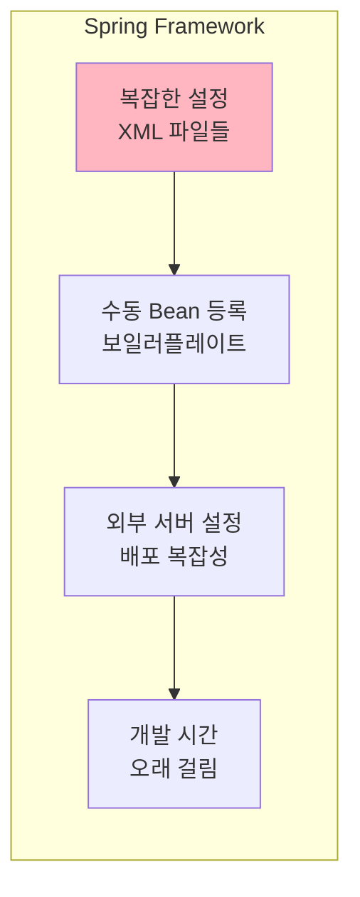

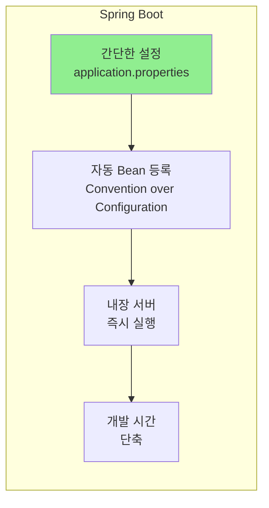

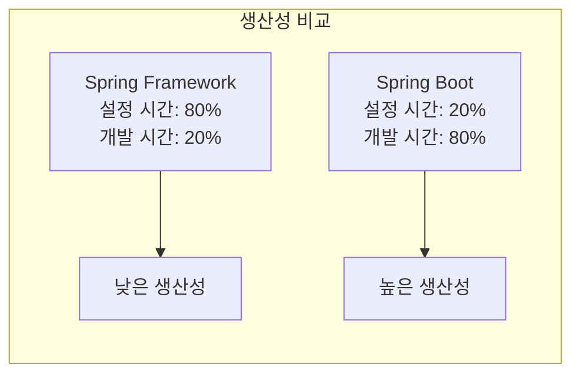

---

#### 6. 성능과 리소스 사용량 비교

**Spring Framework:**
- 외부 서버(Tomcat, JBoss 등) 필요
- 서버 시작 시간: 30초~2분
- 메모리 사용량: 서버 + 애플리케이션
- 배포 과정 복잡

**Spring Boot:**
- 내장 서버 사용
- 서버 시작 시간: 5~15초
- 메모리 사용량: 애플리케이션만
- 즉시 실행 가능

**성능 비교 다이어그램:**
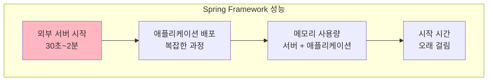

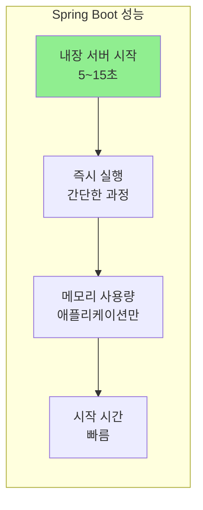

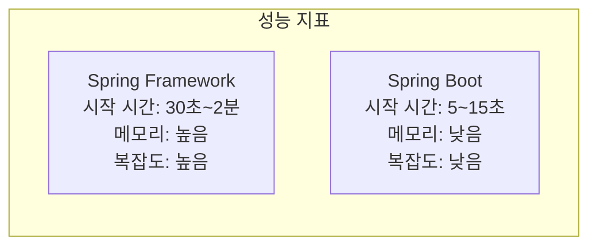

---

#### 7. 사용 시나리오 비교

| 구분 | Spring Framework | Spring Boot |
|------|------------------|-------------|
| **적합한 프로젝트** | 대규모 엔터프라이즈 애플리케이션 | 마이크로서비스, 프로토타입, 빠른 개발 |
| **설정 복잡도** | 높음 (수동 설정) | 낮음 (자동 설정) |
| **학습 곡선** | 가파름 | 완만함 |
| **유연성** | 높음 (세밀한 제어) | 중간 (Convention over Configuration) |
| **개발 속도** | 느림 | 빠름 |
| **배포 복잡도** | 높음 (외부 서버 필요) | 낮음 (JAR 파일 실행) |
| **성능** | 외부 서버 의존 | 내장 서버 사용 |
| **유지보수** | 복잡함 | 간단함 |

#### 8. 마이그레이션 전략

**Spring Framework → Spring Boot 마이그레이션:**
```java
// 1. 단계적 마이그레이션
// Phase 1: Spring Boot Starter 도입
<dependency>
    <groupId>org.springframework.boot</groupId>
    <artifactId>spring-boot-starter-web</artifactId>
</dependency>

// Phase 2: Auto-Configuration 활용
@SpringBootApplication
public class Application {
    public static void main(String[] args) {
        SpringApplication.run(Application.class, args);
    }
}

// Phase 3: 기존 XML 설정을 Java Config로 변환
@Configuration
public class LegacyConfig {
    // 기존 XML 설정을 Java Config로 변환
}
```

**마이그레이션 과정 다이어그램:**
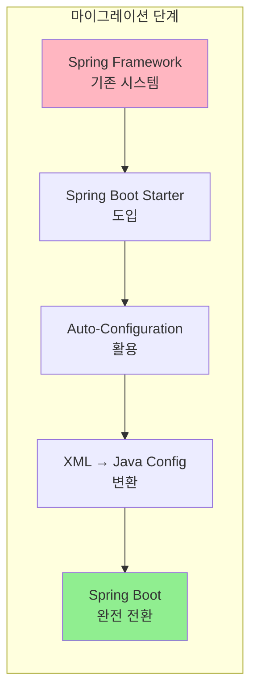


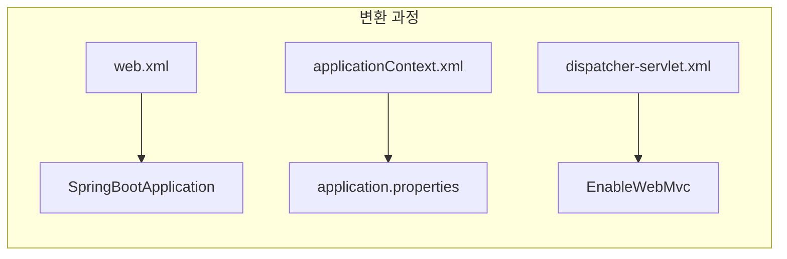

---

#### 결론 및 권장사항

**Spring Framework 사용 시기:**
- 대규모 엔터프라이즈 애플리케이션
- 세밀한 제어가 필요한 경우
- 기존 레거시 시스템과의 통합
- 특정 서버 환경에서 실행해야 하는 경우

**Spring Boot 사용 시기:**
- 마이크로서비스 개발
- 빠른 프로토타입 개발
- REST API 개발
- 독립 실행형 애플리케이션
- 클라우드 환경 배포

**실무 권장사항:**
1. **신규 프로젝트**: Spring Boot 우선 고려
2. **레거시 시스템**: 단계적 마이그레이션
3. **팀 역량**: Spring Boot 학습 비용 고려
4. **요구사항**: 프로젝트 특성에 맞는 선택

> **결론**: Spring Framework는 세밀한 제어와 유연성이 필요한 대규모 엔터프라이즈 애플리케이션에 적합하고, Spring Boot는 빠른 개발과 간편한 배포가 중요한 현대적인 애플리케이션 개발에 적합합니다. 프로젝트의 특성과 요구사항에 따라 적절한 선택이 필요합니다.

## Q02. @SpringBootApplication 어노테이션에 대해서 상세하게 설명하시오

### A. @SpringBootApplication 어노테이션 상세 분석

#### @SpringBootApplication 어노테이션의 정의

**@SpringBootApplication이란?**
- Spring Boot 애플리케이션의 메인 클래스에 사용되는 어노테이션
- Spring Boot의 자동 설정(Auto-Configuration)을 활성화하는 핵심 어노테이션
- 여러 개의 어노테이션을 조합한 메타 어노테이션(Meta-annotation)

#### @SpringBootApplication의 내부 구조

**1. @SpringBootApplication의 실제 정의:**
```java
@Target(ElementType.TYPE)
@Retention(RetentionPolicy.RUNTIME)
@Documented
@Inherited
@SpringBootConfiguration
@EnableAutoConfiguration
@ComponentScan
public @interface SpringBootApplication {
    
    /**
     * 자동 설정을 제외할 클래스들
     */
    @AliasFor(annotation = EnableAutoConfiguration.class)
    Class<?>[] exclude() default {};
    
    /**
     * 자동 설정을 제외할 클래스 이름들
     */
    @AliasFor(annotation = EnableAutoConfiguration.class)
    String[] excludeName() default {};
    
    /**
     * 컴포넌트 스캔할 패키지들
     */
    @AliasFor(annotation = ComponentScan.class)
    String[] scanBasePackages() default {};
    
    /**
     * 컴포넌트 스캔할 클래스들
     */
    @AliasFor(annotation = ComponentScan.class)
    Class<?>[] scanBasePackageClasses() default {};
}
```

**2. @SpringBootApplication이 포함하는 3개의 핵심 어노테이션:**

```java
// 1. @SpringBootConfiguration
@Target(ElementType.TYPE)
@Retention(RetentionPolicy.RUNTIME)
@Documented
@Configuration
public @interface SpringBootConfiguration {
}

// 2. @EnableAutoConfiguration
@Target(ElementType.TYPE)
@Retention(RetentionPolicy.RUNTIME)
@Documented
@Inherited
@AutoConfigurationPackage
@Import(AutoConfigurationImportSelector.class)
public @interface EnableAutoConfiguration {
    String ENABLED_OVERRIDE_PROPERTY = "spring.boot.enableautoconfiguration";
    
    Class<?>[] exclude() default {};
    
    String[] excludeName() default {};
}

// 3. @ComponentScan
@Retention(RetentionPolicy.RUNTIME)
@Target(ElementType.TYPE)
@Documented
@Repeatable(ComponentScans.class)
public @interface ComponentScan {
    String[] basePackages() default {};
    Class<?>[] basePackageClasses() default {};
    Class<? extends BeanNameGenerator> nameGenerator() default BeanNameGenerator.class;
    Class<? extends ScopeMetadataResolver> scopeResolver() default AnnotationScopeMetadataResolver.class;
    ScopedProxyMode scopedProxy() default ScopedProxyMode.DEFAULT;
    String resourcePattern() default ClassPathScanningCandidateComponentProvider.DEFAULT_RESOURCE_PATTERN;
    boolean useDefaultFilters() default true;
    ComponentScan.Filter[] includeFilters() default {};
    ComponentScan.Filter[] excludeFilters() default {};
    boolean lazyInit() default false;
}
```

#### 각 어노테이션의 역할과 동작 방식

**1. @SpringBootConfiguration**
```java
// @SpringBootConfiguration의 실제 구현
@Configuration
public @interface SpringBootConfiguration {
    // @Configuration과 동일한 기능
    // Spring Boot 애플리케이션의 설정 클래스임을 명시
}

// 사용 예시
@SpringBootConfiguration
public class MyConfig {
    @Bean
    public MyService myService() {
        return new MyService();
    }
}
```

**2. @EnableAutoConfiguration**
```java
// @EnableAutoConfiguration의 핵심 동작 과정
@Import(AutoConfigurationImportSelector.class)
public @interface EnableAutoConfiguration {
    // AutoConfigurationImportSelector가 자동 설정을 처리
}

// AutoConfigurationImportSelector의 핵심 메서드
public class AutoConfigurationImportSelector implements DeferredImportSelector {
    
    @Override
    public String[] selectImports(AnnotationMetadata annotationMetadata) {
        // 1. META-INF/spring.factories 파일에서 자동 설정 클래스들을 로드
        // 2. 조건부 어노테이션을 확인하여 적절한 Bean들을 등록
        // 3. 등록할 자동 설정 클래스들의 목록을 반환
    }
    
    protected List<String> getCandidateConfigurations(AnnotationMetadata metadata,
                                                   AnnotationAttributes attributes) {
        // spring.factories에서 EnableAutoConfiguration 키로 등록된 클래스들을 가져옴
        List<String> configurations = SpringFactoriesLoader.loadFactoryNames(
            EnableAutoConfiguration.class, getBeanClassLoader());
        return configurations;
    }
}
```

**3. @ComponentScan**
```java
// @ComponentScan의 동작 과정
@ComponentScan
public class Application {
    // 1. 지정된 패키지에서 @Component, @Service, @Repository, @Controller 어노테이션이 붙은 클래스들을 스캔
    // 2. 발견된 클래스들을 Spring Bean으로 등록
    // 3. 기본값으로 @SpringBootApplication이 붙은 클래스의 패키지부터 스캔
}
```

#### @SpringBootApplication의 동작 과정

**1. 애플리케이션 시작 시 실행되는 과정:**
```java
@SpringBootApplication
public class Application {
    public static void main(String[] args) {
        SpringApplication.run(Application.class, args);
    }
}

// SpringApplication.run()의 내부 동작 과정
public class SpringApplication {
    
    public static ConfigurableApplicationContext run(Class<?>[] primarySources, String[] args) {
        return new SpringApplication(primarySources).run(args);
    }
    
    public ConfigurableApplicationContext run(String... args) {
        // 1. StopWatch 시작
        StopWatch stopWatch = new StopWatch();
        stopWatch.start();
        
        // 2. ApplicationContext 생성
        ConfigurableApplicationContext context = null;
        
        try {
            // 3. ApplicationArguments 준비
            ApplicationArguments applicationArguments = new DefaultApplicationArguments(args);
            
            // 4. 환경 설정
            ConfigurableEnvironment environment = prepareEnvironment(listeners, applicationArguments);
            
            // 5. Banner 출력
            Banner printedBanner = printBanner(environment);
            
            // 6. ApplicationContext 생성
            context = createApplicationContext();
            
            // 7. ApplicationContext 준비
            prepareContext(context, environment, listeners, applicationArguments, printedBanner);
            
            // 8. ApplicationContext 새로고침 (핵심!)
            refreshContext(context);
            
            // 9. ApplicationContext 새로고침 후 처리
            afterRefresh(context, applicationArguments);
            
            // 10. StopWatch 종료
            stopWatch.stop();
            
            return context;
        } catch (Throwable ex) {
            handleRunFailure(context, listeners, analyzers, ex);
            throw new IllegalStateException(ex);
        }
    }
}
```

**2. Auto-Configuration 동작 과정:**
```java
// AutoConfigurationImportSelector의 상세 동작
public class AutoConfigurationImportSelector implements DeferredImportSelector {
    
    @Override
    public String[] selectImports(AnnotationMetadata annotationMetadata) {
        // 1. 자동 설정 메타데이터 로드
        AutoConfigurationMetadata autoConfigurationMetadata = 
            AutoConfigurationMetadataLoader.loadMetadata(this.beanClassLoader);
        
        // 2. 자동 설정 후보들 가져오기
        List<String> configurations = getCandidateConfigurations(annotationMetadata, attributes);
        
        // 3. 중복 제거
        configurations = removeDuplicates(configurations);
        
        // 4. 제외할 설정들 제거
        configurations = filter(configurations, autoConfigurationMetadata);
        
        // 5. 이벤트 발생
        fireAutoConfigurationImportEvents(configurations, exclusions);
        
        return configurations.toArray(new String[0]);
    }
    
    protected List<String> getCandidateConfigurations(AnnotationMetadata metadata,
                                                   AnnotationAttributes attributes) {
        // META-INF/spring.factories에서 EnableAutoConfiguration 키로 등록된 클래스들
        List<String> configurations = SpringFactoriesLoader.loadFactoryNames(
            EnableAutoConfiguration.class, getBeanClassLoader());
        
        return configurations;
    }
}
```

#### META-INF/spring.factories 파일의 역할

**spring.factories 파일의 구조:**
```properties
# META-INF/spring.factories
org.springframework.boot.autoconfigure.EnableAutoConfiguration=\
org.springframework.boot.autoconfigure.web.servlet.WebMvcAutoConfiguration,\
org.springframework.boot.autoconfigure.jdbc.DataSourceAutoConfiguration,\
org.springframework.boot.autoconfigure.orm.jpa.HibernateJpaAutoConfiguration,\
org.springframework.boot.autoconfigure.data.jpa.JpaRepositoriesAutoConfiguration,\
org.springframework.boot.autoconfigure.jackson.JacksonAutoConfiguration,\
org.springframework.boot.autoconfigure.security.servlet.SecurityAutoConfiguration,\
org.springframework.boot.autoconfigure.cache.CacheAutoConfiguration,\
org.springframework.boot.autoconfigure.transaction.TransactionAutoConfiguration
```

**Auto-Configuration 클래스의 예시:**
```java
// WebMvcAutoConfiguration의 예시
@Configuration(proxyBeanMethods = false)
@ConditionalOnWebApplication(type = Type.SERVLET)
@ConditionalOnClass({ Servlet.class, DispatcherServlet.class, WebMvcConfigurer.class })
@ConditionalOnMissingBean(WebMvcConfigurationSupport.class)
@AutoConfigureOrder(Ordered.HIGHEST_PRECEDENCE + 10)
@AutoConfigureAfter({ DispatcherServletAutoConfiguration.class, TaskExecutionAutoConfiguration.class,
        ValidationAutoConfiguration.class })
public class WebMvcAutoConfiguration {
    
    @Configuration(proxyBeanMethods = false)
    @Import(EnableWebMvcConfiguration.class)
    @EnableConfigurationProperties({ WebMvcProperties.class, ResourceProperties.class })
    @Order(0)
    public static class WebMvcAutoConfigurationAdapter implements WebMvcConfigurer {
        
        // WebMvcConfigurer 구현
        // ViewResolver, ResourceHandler 등 설정
    }
}
```

#### @SpringBootApplication의 동작 과정 다이어그램

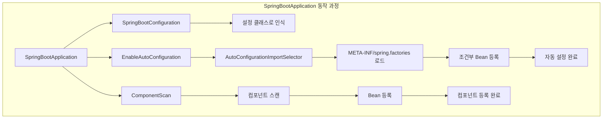

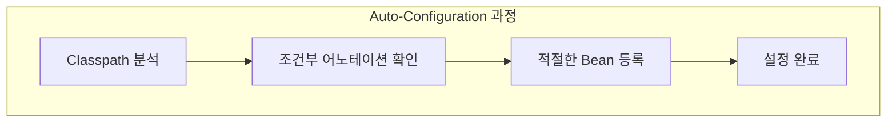

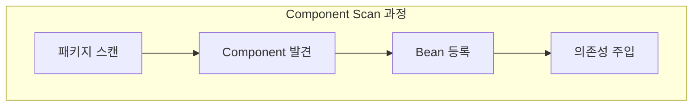

#### 조건부 어노테이션의 동작 방식

**1. @ConditionalOnClass 예시:**
```java
@Configuration
@ConditionalOnClass({ DataSource.class, JdbcTemplate.class })
@ConditionalOnMissingBean(type = "org.springframework.jdbc.core.JdbcOperations")
@EnableConfigurationProperties(JdbcProperties.class)
@AutoConfigureAfter(DataSourceAutoConfiguration.class)
public class JdbcTemplateAutoConfiguration {
    
    @Bean
    @Primary
    @ConditionalOnMissingBean
    public JdbcTemplate jdbcTemplate(DataSource dataSource) {
        return new JdbcTemplate(dataSource);
    }
}
```

**2. 조건부 어노테이션의 종류:**
```java
// 클래스 존재 여부
@ConditionalOnClass(DataSource.class)
@ConditionalOnMissingClass("org.hibernate.Session")

// Bean 존재 여부
@ConditionalOnBean(DataSource.class)
@ConditionalOnMissingBean(JdbcTemplate.class)

// 프로퍼티 값
@ConditionalOnProperty(name = "spring.datasource.type", havingValue = "com.zaxxer.hikari.HikariDataSource")

// 웹 애플리케이션 타입
@ConditionalOnWebApplication(type = Type.SERVLET)
@ConditionalOnNotWebApplication

// 리소스 존재 여부
@ConditionalOnResource(resources = "classpath:application.properties")
```

#### @SpringBootApplication의 커스터마이징

**1. 자동 설정 제외:**
```java
@SpringBootApplication(exclude = {
    DataSourceAutoConfiguration.class,
    SecurityAutoConfiguration.class
})
public class Application {
    public static void main(String[] args) {
        SpringApplication.run(Application.class, args);
    }
}
```

**2. 컴포넌트 스캔 범위 지정:**
```java
@SpringBootApplication(scanBasePackages = {
    "com.example.controller",
    "com.example.service"
})
public class Application {
    public static void main(String[] args) {
        SpringApplication.run(Application.class, args);
    }
}
```

**3. 별도 설정 클래스 사용:**
```java
@SpringBootApplication
@Import(MyCustomConfiguration.class)
public class Application {
    public static void main(String[] args) {
        SpringApplication.run(Application.class, args);
    }
}

@Configuration
public class MyCustomConfiguration {
    @Bean
    public MyCustomService myCustomService() {
        return new MyCustomService();
    }
}
```

#### @SpringBootApplication의 내부 동작 시퀀스

```mermaid
sequenceDiagram
    participant App as Application
    participant Spring as SpringApplication
    participant Context as ApplicationContext
    participant Auto as AutoConfiguration
    participant Scan as ComponentScan
    
    App->>Spring: SpringApplication.run()
    Spring->>Context: createApplicationContext()
    Context->>Auto: @EnableAutoConfiguration 처리
    Auto->>Auto: spring.factories 로드
    Auto->>Auto: 조건부 Bean 등록
    Context->>Scan: @ComponentScan 처리
    Scan->>Scan: 패키지 스캔
    Scan->>Context: Bean 등록
    Context->>Spring: refreshContext()
    Spring->>App: ApplicationContext 반환
```

#### 실무에서의 활용 팁

**1. 성능 최적화:**
```java
// 필요한 자동 설정만 포함
@SpringBootApplication(exclude = {
    DataSourceAutoConfiguration.class,  // DB 사용하지 않는 경우
    SecurityAutoConfiguration.class     // 보안 사용하지 않는 경우
})
public class Application {
    // 애플리케이션 시작 시간 단축
}
```

**2. 테스트 환경 설정:**
```java
@SpringBootApplication
@TestConfiguration
public class TestApplication {
    // 테스트용 설정
    @Bean
    @Primary
    public TestService testService() {
        return new TestService();
    }
}
```

**3. 프로파일별 설정:**
```java
@SpringBootApplication
@Profile("dev")
public class DevApplication {
    // 개발 환경용 설정
}

@SpringBootApplication
@Profile("prod")
public class ProdApplication {
    // 운영 환경용 설정
}
```

> **결론**: @SpringBootApplication은 Spring Boot의 핵심 어노테이션으로, @SpringBootConfiguration, @EnableAutoConfiguration, @ComponentScan을 조합하여 최소한의 설정으로 Spring Boot 애플리케이션을 시작할 수 있게 해줍니다. 내부적으로는 AutoConfigurationImportSelector를 통해 META-INF/spring.factories 파일에서 자동 설정 클래스들을 로드하고, 조건부 어노테이션을 확인하여 적절한 Bean들을 등록하는 복잡한 과정을 거칩니다.

## Q03. @ComponentScan 에 대해서 설명하고, 스프링이 ComponentScan을 수행하여 컨텍스트에 빈을 등록하는 과정을 설명해줘

### A03. @ComponentScan 상세 분석

#### @ComponentScan 어노테이션의 정의

**@ComponentScan이란?**
- Spring Framework에서 컴포넌트를 자동으로 스캔하고 Bean으로 등록하는 어노테이션
- 지정된 패키지에서 @Component, @Service, @Repository, @Controller 등의 어노테이션이 붙은 클래스들을 찾아서 Spring Bean으로 등록
- Spring Boot의 @SpringBootApplication에 포함되어 있음

**@ComponentScan의 기본 동작:**
```java
@ComponentScan
public class Application {
    // 기본적으로 @ComponentScan이 붙은 클래스의 패키지부터 스캔
    // com.example.Application이면 com.example 패키지부터 스캔
}
```

#### @ComponentScan의 내부 구조

**1. @ComponentScan 어노테이션의 정의:**
```java
@Retention(RetentionPolicy.RUNTIME)
@Target(ElementType.TYPE)
@Documented
@Repeatable(ComponentScans.class)
public @interface ComponentScan {
    
    /**
     * 스캔할 기본 패키지들
     */
    String[] basePackages() default {};
    
    /**
     * 스캔할 기본 패키지 클래스들
     */
    Class<?>[] basePackageClasses() default {};
    
    /**
     * Bean 이름 생성기
     */
    Class<? extends BeanNameGenerator> nameGenerator() default BeanNameGenerator.class;
    
    /**
     * 스코프 메타데이터 리졸버
     */
    Class<? extends ScopeMetadataResolver> scopeResolver() default AnnotationScopeMetadataResolver.class;
    
    /**
     * 스코프 프록시 모드
     */
    ScopedProxyMode scopedProxy() default ScopedProxyMode.DEFAULT;
    
    /**
     * 리소스 패턴
     */
    String resourcePattern() default ClassPathScanningCandidateComponentProvider.DEFAULT_RESOURCE_PATTERN;
    
    /**
     * 기본 필터 사용 여부
     */
    boolean useDefaultFilters() default true;
    
    /**
     * 포함할 필터들
     */
    Filter[] includeFilters() default {};
    
    /**
     * 제외할 필터들
     */
    Filter[] excludeFilters() default {};
    
    /**
     * 지연 초기화 여부
     */
    boolean lazyInit() default false;
}
```

**2. @ComponentScan의 기본 필터:**
```java
// @ComponentScan의 기본 필터들
@Component
@Service
@Repository
@Controller
@Configuration
@RestController
@Repository
```

#### @ComponentScan의 동작 과정

**1. ComponentScan의 전체 동작 흐름:**
```java
// ComponentScan의 핵심 처리 과정
public class ComponentScanAnnotationParser {
    
    public Set<BeanDefinitionHolder> parse(AnnotationAttributes componentScan,
                                         String declaringClass) {
        
        // 1. 스캔할 패키지 결정
        Set<String> basePackages = getBasePackages(componentScan);
        
        // 2. 컴포넌트 스캐너 생성
        ClassPathBeanDefinitionScanner scanner = new ClassPathBeanDefinitionScanner(registry);
        
        // 3. 필터 설정
        configureScanner(scanner, componentScan);
        
        // 4. 실제 스캔 수행
        return scanner.doScan(basePackages.toArray(new String[0]));
    }
}
```

**2. ClassPathBeanDefinitionScanner의 스캔 과정:**
```java
public class ClassPathBeanDefinitionScanner extends ClassPathScanningCandidateComponentProvider {
    
    public Set<BeanDefinitionHolder> doScan(String... basePackages) {
        Set<BeanDefinitionHolder> beanDefinitions = new LinkedHashSet<>();
        
        for (String basePackage : basePackages) {
            // 1. 후보 컴포넌트 찾기
            Set<BeanDefinition> candidates = findCandidateComponents(basePackage);
            
            for (BeanDefinition beanDefinition : candidates) {
                // 2. Bean 이름 생성
                String beanName = generateBeanName(beanDefinition);
                
                // 3. Bean 정의 등록
                registerBeanDefinition(beanName, beanDefinition);
                
                beanDefinitions.add(new BeanDefinitionHolder(beanDefinition, beanName));
            }
        }
        
        return beanDefinitions;
    }
    
    protected Set<BeanDefinition> findCandidateComponents(String basePackage) {
        Set<BeanDefinition> candidates = new LinkedHashSet<>();
        
        try {
            // 1. 패키지 내의 모든 클래스 파일 찾기
            String packageSearchPath = ResourcePatternResolver.CLASSPATH_ALL_URL_PREFIX +
                resolveBasePackage(basePackage) + '/' + this.resourcePattern;
            
            Resource[] resources = this.resourcePatternResolver.getResources(packageSearchPath);
            
            for (Resource resource : resources) {
                // 2. 각 리소스를 클래스로 변환
                if (resource.isReadable()) {
                    MetadataReader metadataReader = this.metadataReaderFactory.getMetadataReader(resource);
                    
                    // 3. 컴포넌트 필터 적용
                    if (isCandidateComponent(metadataReader)) {
                        BeanDefinition beanDefinition = new ScannedGenericBeanDefinition(metadataReader);
                        candidates.add(beanDefinition);
                    }
                }
            }
        } catch (IOException ex) {
            throw new BeanDefinitionStoreException("I/O failure during classpath scanning", ex);
        }
        
        return candidates;
    }
}
```

#### @ComponentScan의 상세 동작 과정

**1. 패키지 스캔 과정:**
```mermaid
graph TB
    subgraph "ComponentScan 전체 과정"
        A[ComponentScan] --> B[패키지 결정]
        B --> C[스캐너 생성]
        C --> D[필터 설정]
        D --> E[실제 스캔]
        E --> F[Bean 등록]
    end
```

```mermaid
graph TB
    subgraph "패키지 스캔 과정"
        G[basePackages 분석] --> H[클래스패스 리소스 검색]
        H --> I[클래스 파일 발견]
        I --> J[메타데이터 읽기]
        J --> K[컴포넌트 필터 적용]
        K --> L[BeanDefinition 생성]
    end

```

```mermaid  
graph TB  
    subgraph "Bean 등록 과정"
        M[Bean 이름 생성] --> N[BeanDefinition 등록]
        N --> O[의존성 분석]
        O --> P[Bean 초기화]
    end
```

**2. 컴포넌트 필터링 과정:**
```mermaid
graph LR
    subgraph "기본 필터"
        A[Component] --> D[포함]
        B[Service] --> D
        C[Repository] --> D
        E[Controller] --> D
    end
```

```mermaid
graph LR    
    subgraph "커스텀 필터"
        F[includeFilters] --> G[포함할 조건]
        H[excludeFilters] --> I[제외할 조건]
    end

```

```mermaid
graph LR        
    subgraph "필터 적용"
        J[클래스 메타데이터] --> K[기본 필터 확인]
        K --> L[커스텀 필터 확인]
        L --> M[최종 결과]
    end
```

#### @ComponentScan의 실제 사용 예시

**1. 기본 사용법:**
```java
@Configuration
@ComponentScan
public class AppConfig {
    // 기본 패키지에서 스캔
}

@Service
public class UserService {
    // 자동으로 Bean으로 등록됨
}

@Repository
public class UserRepository {
    // 자동으로 Bean으로 등록됨
}
```

**2. 특정 패키지 스캔:**
```java
@Configuration
@ComponentScan(basePackages = {
    "com.example.service",
    "com.example.repository"
})
public class AppConfig {
    // 지정된 패키지만 스캔
}
```

**3. 필터 사용:**
```java
@Configuration
@ComponentScan(
    basePackages = "com.example",
    includeFilters = @ComponentScan.Filter(type = FilterType.REGEX, pattern = ".*Service"),
    excludeFilters = @ComponentScan.Filter(type = FilterType.ANNOTATION, classes = Exclude.class)
)
public class AppConfig {
    // 정규식으로 Service로 끝나는 클래스만 포함
    // @Exclude 어노테이션이 붙은 클래스는 제외
}
```

#### Spring이 ComponentScan을 수행하는 상세 과정

**1. 스캔 준비 단계:**
```java
// 1. ComponentScan 어노테이션 파싱
@ComponentScan(basePackages = "com.example")
public class Application {
    // Spring이 이 어노테이션을 읽어서 스캔 설정을 파악
}

// 2. 스캐너 초기화
ClassPathBeanDefinitionScanner scanner = new ClassPathBeanDefinitionScanner(registry);
scanner.setResourceLoader(resourceLoader);
scanner.setEnvironment(environment);
scanner.setBeanNameGenerator(beanNameGenerator);
scanner.setBeanDefinitionDefaults(beanDefinitionDefaults);
scanner.setAutowireCandidatePatterns(autowireCandidatePatterns);
```

**2. 패키지 스캔 단계:**
```java
// 3. 패키지 내 클래스 파일 검색
String packageSearchPath = "classpath*:com/example/**/*.class";
Resource[] resources = resourcePatternResolver.getResources(packageSearchPath);

// 4. 각 클래스 파일 처리
for (Resource resource : resources) {
    MetadataReader metadataReader = metadataReaderFactory.getMetadataReader(resource);
    
    // 5. 컴포넌트 필터 적용
    if (isCandidateComponent(metadataReader)) {
        // 6. BeanDefinition 생성
        BeanDefinition beanDefinition = new ScannedGenericBeanDefinition(metadataReader);
        candidates.add(beanDefinition);
    }
}
```

**3. Bean 등록 단계:**
```java
// 7. Bean 이름 생성
String beanName = generateBeanName(beanDefinition);

// 8. BeanDefinition 등록
registry.registerBeanDefinition(beanName, beanDefinition);

// 9. 의존성 주입 준비
if (beanDefinition instanceof AbstractBeanDefinition) {
    ((AbstractBeanDefinition) beanDefinition).setAutowireMode(AbstractBeanDefinition.AUTOWIRE_BY_TYPE);
}
```

#### ComponentScan의 상세 동작 시퀀스

```mermaid
sequenceDiagram
    participant Spring as Spring Container
    participant Scanner as ComponentScanner
    participant Registry as BeanDefinitionRegistry
    participant Resource as ResourceLoader
    participant Metadata as MetadataReader
    
    Spring->>Scanner: ComponentScan 시작
    Scanner->>Scanner: 패키지 경로 분석
    Scanner->>Resource: 클래스패스 리소스 검색
    Resource-->>Scanner: 클래스 파일 목록 반환
    
    loop 각 클래스 파일
        Scanner->>Metadata: 메타데이터 읽기
        Metadata-->>Scanner: 클래스 정보 반환
        Scanner->>Scanner: 컴포넌트 필터 적용
        
        alt 필터 통과
            Scanner->>Scanner: BeanDefinition 생성
            Scanner->>Registry: Bean 등록
            Registry-->>Scanner: 등록 완료
        else 필터 실패
            Scanner->>Scanner: 스킵
        end
    end
    
    Scanner-->>Spring: 스캔 완료
```

#### @ComponentScan의 고급 기능

**1. 커스텀 필터:**
```java
// 커스텀 필터 클래스
public class MyComponentFilter implements TypeFilter {
    @Override
    public boolean match(MetadataReader metadataReader, MetadataReaderFactory metadataReaderFactory) {
        // 커스텀 필터링 로직
        return metadataReader.getAnnotationMetadata().hasAnnotation("com.example.MyAnnotation");
    }
}

// 사용
@Configuration
@ComponentScan(
    basePackages = "com.example",
    includeFilters = @ComponentScan.Filter(type = FilterType.CUSTOM, classes = MyComponentFilter.class)
)
public class AppConfig {
}
```

**2. 스캔 범위 제한:**
```java
@Configuration
@ComponentScan(
    basePackages = "com.example",
    resourcePattern = "**/*Service.class"  // Service로 끝나는 클래스만
)
public class AppConfig {
}
```

**3. 지연 초기화:**
```java
@Configuration
@ComponentScan(
    basePackages = "com.example",
    lazyInit = true  // 지연 초기화 활성화
)
public class AppConfig {
}
```

#### ComponentScan의 성능 최적화

**1. 스캔 범위 최적화:**
```java
// 잘못된 예시 - 너무 넓은 범위
@ComponentScan(basePackages = "com")  // 너무 많은 패키지 스캔

// 올바른 예시 - 구체적인 범위
@ComponentScan(basePackages = {
    "com.example.service",
    "com.example.repository"
})
```

**2. 필터 활용:**
```java
@Configuration
@ComponentScan(
    basePackages = "com.example",
    excludeFilters = @ComponentScan.Filter(
        type = FilterType.REGEX, 
        pattern = ".*Test.*"  // Test가 포함된 클래스 제외
    )
)
public class AppConfig {
}
```

#### ComponentScan의 문제 해결

**1. 스캔되지 않는 컴포넌트:**
```java
// 문제: 패키지 경로가 잘못됨
@ComponentScan(basePackages = "com.example")  // 실제 패키지: com.example.app

// 해결: 정확한 패키지 경로 지정
@ComponentScan(basePackages = "com.example.app")
```

**2. 중복 Bean 등록:**
```java
// 문제: 같은 이름의 Bean이 여러 번 등록됨
@Service("userService")
public class UserService { }

@Service("userService")  // 중복!
public class AnotherUserService { }

// 해결: 고유한 Bean 이름 사용
@Service("primaryUserService")
public class UserService { }

@Service("secondaryUserService")
public class AnotherUserService { }
```

#### ComponentScan의 내부 동작 다이어그램

```mermaid
graph TB
    subgraph "ComponentScan 내부 동작"
        A[ComponentScan 시작] --> B[패키지 경로 분석]
        B --> C[클래스패스 리소스 검색]
        C --> D[클래스 파일 발견]
        D --> E[메타데이터 읽기]
        E --> F[컴포넌트 필터 적용]
        
        F --> G{필터 통과?}
        G -->|Yes| H[BeanDefinition 생성]
        G -->|No| I[스킵]
        
        H --> J[Bean 이름 생성]
        J --> K[BeanDefinition 등록]
        K --> L[의존성 분석]
        L --> M[Bean 초기화 준비]
    end

```

```mermaid
graph LR        
    subgraph "필터 종류"
        N[기본 필터] --> O[Component, Service, Repository, Controller]
        P[커스텀 필터] --> Q[includeFilters, excludeFilters]
        R[타입 필터] --> S[FilterType.ANNOTATION, FilterType.REGEX]
    end

```

```mermaid
graph LR        
    subgraph "Bean 등록 과정"
        T[BeanDefinition 생성] --> U[Bean 이름 결정]
        U --> V[BeanDefinition 등록]
        V --> W[의존성 주입 준비]
    end
```

#### 실무 권장사항

**1. 스캔 범위 최적화:**
- 필요한 패키지만 스캔하도록 범위 제한
- 불필요한 클래스는 excludeFilters로 제외
- 성능 향상을 위한 구체적인 패키지 지정

**2. 명명 규칙 준수:**
- Bean 이름 충돌 방지를 위한 명확한 명명 규칙
- 패키지 구조를 통한 논리적 분리
- 컴포넌트 역할에 맞는 어노테이션 사용

**3. 테스트 환경 고려:**
- 테스트용 컴포넌트는 별도 패키지로 분리
- 테스트 시 필요한 컴포넌트만 스캔하도록 설정
- @TestConfiguration 활용

> **결론**: @ComponentScan은 Spring의 핵심 기능으로, 지정된 패키지에서 컴포넌트를 자동으로 발견하고 Bean으로 등록합니다. 내부적으로는 ClassPathBeanDefinitionScanner를 통해 클래스패스를 스캔하고, 필터를 적용하여 적절한 컴포넌트만 Bean으로 등록하는 복잡한 과정을 거칩니다. 효율적인 사용을 위해서는 스캔 범위 최적화와 적절한 필터 활용이 중요합니다.
