# SpringFramework와 SpringBoot 에 대해서 이해하기

## Q01. SpringFramework와 SpringBoot 의 차이점 설명 

### A01. Spring Framework vs Spring Boot 상세 비교

#### 기본 개념과 정의

**Spring Framework:**
- 자바 플랫폼을 위한 오픈소스 애플리케이션 프레임워크
- 엔터프라이즈급 애플리케이션 개발을 위한 종합적인 프로그래밍 및 구성 모델 제공
- IoC(Inversion of Control)와 DI(Dependency Injection)를 핵심으로 하는 프레임워크

**Spring Boot:**
- Spring Framework 기반의 자동 구성(Auto-Configuration) 기능을 제공하는 프레임워크
- 독립 실행형(Stand-alone) 애플리케이션 개발을 위한 도구
- 최소한의 설정으로 Spring 애플리케이션을 빠르게 시작할 수 있도록 설계

---

#### 1. 설정(Configuration) 차이점

**Spring Framework 설정:**
```xml
<!-- web.xml -->
<web-app>
    <servlet>
        <servlet-name>dispatcher</servlet-name>
        <servlet-class>org.springframework.web.servlet.DispatcherServlet</servlet-class>
        <load-on-startup>1</load-on-startup>
    </servlet>
    
    <servlet-mapping>
        <servlet-name>dispatcher</servlet-name>
        <url-pattern>/</url-pattern>
    </servlet-mapping>
</web-app>

<!-- applicationContext.xml -->
<beans xmlns="http://www.springframework.org/schema/beans"
       xmlns:xsi="http://www.w3.org/2001/XMLSchema-instance"
       xsi:schemaLocation="http://www.springframework.org/schema/beans
       http://www.springframework.org/schema/beans/spring-beans.xsd">
    
    <bean id="userService" class="com.example.service.UserService">
        <property name="userRepository" ref="userRepository"/>
    </bean>
    
    <bean id="userRepository" class="com.example.repository.UserRepository"/>
</beans>

<!-- dispatcher-servlet.xml -->
<beans xmlns="http://www.springframework.org/schema/beans"
       xmlns:mvc="http://www.springframework.org/schema/mvc"
       xmlns:context="http://www.springframework.org/schema/context"
       xsi:schemaLocation="...">
    
    <context:component-scan base-package="com.example"/>
    <mvc:annotation-driven/>
    <mvc:resources mapping="/resources/**" location="/resources/"/>
</beans>
```

**Spring Boot 설정:**
```java
// application.properties 또는 application.yml
spring.datasource.url=jdbc:h2:mem:testdb
spring.datasource.driver-class-name=org.h2.Driver
spring.jpa.hibernate.ddl-auto=create-drop
spring.jpa.show-sql=true

// 또는 Java Configuration
@Configuration
@EnableWebMvc
@ComponentScan("com.example")
public class WebConfig {
    // 최소한의 설정만 필요
}
```

**설정 복잡도 비교:**
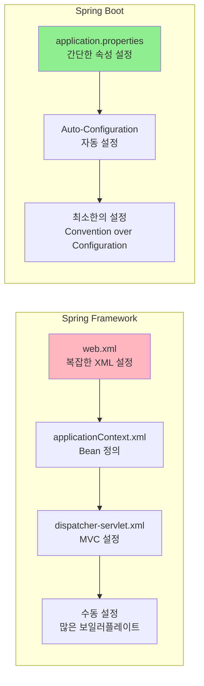

---

#### 2. 의존성 관리 차이점

**Spring Framework 의존성 관리:**
```xml
<!-- pom.xml -->
<dependencies>
    <!-- Spring Core -->
    <dependency>
        <groupId>org.springframework</groupId>
        <artifactId>spring-core</artifactId>
        <version>5.3.20</version>
    </dependency>
    
    <!-- Spring Context -->
    <dependency>
        <groupId>org.springframework</groupId>
        <artifactId>spring-context</artifactId>
        <version>5.3.20</version>
    </dependency>
    
    <!-- Spring Web MVC -->
    <dependency>
        <groupId>org.springframework</groupId>
        <artifactId>spring-webmvc</artifactId>
        <version>5.3.20</version>
    </dependency>
    
    <!-- Spring JDBC -->
    <dependency>
        <groupId>org.springframework</groupId>
        <artifactId>spring-jdbc</artifactId>
        <version>5.3.20</version>
    </dependency>
    
    <!-- Hibernate -->
    <dependency>
        <groupId>org.hibernate</groupId>
        <artifactId>hibernate-core</artifactId>
        <version>5.6.9.Final</version>
    </dependency>
    
    <!-- MySQL Connector -->
    <dependency>
        <groupId>mysql</groupId>
        <artifactId>mysql-connector-java</artifactId>
        <version>8.0.28</version>
    </dependency>
    
    <!-- Servlet API -->
    <dependency>
        <groupId>javax.servlet</groupId>
        <artifactId>javax.servlet-api</artifactId>
        <version>4.0.1</version>
        <scope>provided</scope>
    </dependency>
</dependencies>
```

**Spring Boot 의존성 관리:**
```xml
<!-- pom.xml -->
<parent>
    <groupId>org.springframework.boot</groupId>
    <artifactId>spring-boot-starter-parent</artifactId>
    <version>2.7.0</version>
</parent>

<dependencies>
    <!-- Spring Boot Starter Web -->
    <dependency>
        <groupId>org.springframework.boot</groupId>
        <artifactId>spring-boot-starter-web</artifactId>
    </dependency>
    
    <!-- Spring Boot Starter Data JPA -->
    <dependency>
        <groupId>org.springframework.boot</groupId>
        <artifactId>spring-boot-starter-data-jpa</artifactId>
    </dependency>
    
    <!-- H2 Database -->
    <dependency>
        <groupId>com.h2database</groupId>
        <artifactId>h2</artifactId>
        <scope>runtime</scope>
    </dependency>
</dependencies>
```

**의존성 관리 비교 다이어그램:**
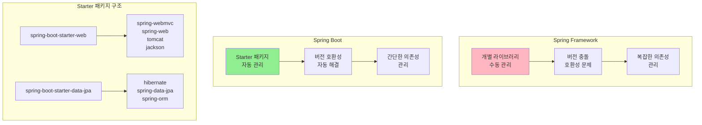

---

#### 3. 애플리케이션 시작 방식 차이점

**Spring Framework 시작:**
```java
// 1. web.xml 기반 설정
// 2. 서버 배포 필요 (WAR 파일)
// 3. 외부 서버(Tomcat, JBoss 등) 필요

// Main 클래스 (별도 필요 없음)
public class Main {
    public static void main(String[] args) {
        // Spring Framework는 별도 Main 클래스 불필요
        // 웹 애플리케이션은 서버에 배포하여 실행
    }
}

// 배포 과정
// 1. mvn clean package
// 2. target/application.war 생성
// 3. Tomcat/webapps/ 폴더에 배포
// 4. Tomcat 시작
// 5. http://localhost:8080/application 접속
```

**Spring Boot 시작:**
```java
@SpringBootApplication
public class Application {
    public static void main(String[] args) {
        SpringApplication.run(Application.class, args);
    }
}

// 실행 과정
// 1. java -jar application.jar
// 2. 내장 톰캣 자동 시작
// 3. http://localhost:8080 접속
```

**애플리케이션 시작 방식 비교:**
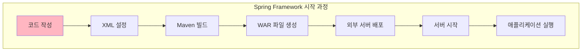

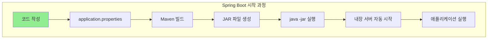

---

#### 4. Auto-Configuration vs Manual Configuration

**Spring Framework Manual Configuration:**
```java
// 1. DataSource 설정
@Configuration
public class DatabaseConfig {
    
    @Bean
    public DataSource dataSource() {
        DriverManagerDataSource dataSource = new DriverManagerDataSource();
        dataSource.setDriverClassName("com.mysql.cj.jdbc.Driver");
        dataSource.setUrl("jdbc:mysql://localhost:3306/testdb");
        dataSource.setUsername("root");
        dataSource.setPassword("password");
        return dataSource;
    }
    
    @Bean
    public LocalSessionFactoryBean sessionFactory() {
        LocalSessionFactoryBean sessionFactory = new LocalSessionFactoryBean();
        sessionFactory.setDataSource(dataSource());
        sessionFactory.setPackagesToScan("com.example.entity");
        sessionFactory.setHibernateProperties(hibernateProperties());
        return sessionFactory;
    }
    
    @Bean
    public HibernateTransactionManager transactionManager() {
        HibernateTransactionManager transactionManager = new HibernateTransactionManager();
        transactionManager.setSessionFactory(sessionFactory().getObject());
        return transactionManager;
    }
    
    private Properties hibernateProperties() {
        Properties properties = new Properties();
        properties.put("hibernate.dialect", "org.hibernate.dialect.MySQL8Dialect");
        properties.put("hibernate.show_sql", "true");
        properties.put("hibernate.hbm2ddl.auto", "create-drop");
        return properties;
    }
}

// 2. Web MVC 설정
@Configuration
@EnableWebMvc
public class WebConfig implements WebMvcConfigurer {
    
    @Override
    public void addResourceHandlers(ResourceHandlerRegistry registry) {
        registry.addResourceHandler("/static/**")
                .addResourceLocations("/static/");
    }
    
    @Bean
    public ViewResolver viewResolver() {
        InternalResourceViewResolver resolver = new InternalResourceViewResolver();
        resolver.setPrefix("/WEB-INF/views/");
        resolver.setSuffix(".jsp");
        return resolver;
    }
}
```

**Spring Boot Auto-Configuration:**
```java
// 1. 최소한의 설정만 필요
@SpringBootApplication
public class Application {
    public static void main(String[] args) {
        SpringApplication.run(Application.class, args);
    }
}

// 2. application.properties만으로 설정
spring.datasource.url=jdbc:mysql://localhost:3306/testdb
spring.datasource.username=root
spring.datasource.password=password
spring.jpa.hibernate.ddl-auto=create-drop
spring.jpa.show-sql=true

// 3. 필요시에만 추가 설정
@Configuration
public class CustomConfig {
    // 커스텀 설정만 추가
}
```

**Auto-Configuration 동작 방식:**
```mermaid
graph TB
    subgraph "Spring Boot Auto-Configuration"
        A[@SpringBootApplication] --> B[Component Scan]
        B --> C[Classpath 분석]
        C --> D[조건부 Bean 등록]
        D --> E[자동 설정 완료]
    end
    style A fill:#90EE90
```

```mermaid
graph TB    
    subgraph "조건부 Bean 등록 과정"
        F[@ConditionalOnClass<br/>DataSource.class] --> G[DataSource Bean 등록]
        H[@ConditionalOnClass<br/>JpaRepository.class] --> I[JPA Bean 등록]
        J[@ConditionalOnClass<br/>WebMvcConfigurer.class] --> K[MVC Bean 등록]
    end
```


---

#### 5. 개발 생산성 비교

**Spring Framework 개발 과정:**
```java
// 1. 프로젝트 구조 설정
src/
├── main/
│   ├── java/
│   │   └── com/example/
│   │       ├── controller/
│   │       ├── service/
│   │       ├── repository/
│   │       └── entity/
│   ├── resources/
│   │   ├── applicationContext.xml
│   │   └── database.properties
│   └── webapp/
│       ├── WEB-INF/
│       │   ├── web.xml
│       │   └── dispatcher-servlet.xml
│       └── static/
└── test/

// 2. 복잡한 설정 파일들
// web.xml, applicationContext.xml, dispatcher-servlet.xml 등

// 3. 수동 Bean 등록
@Configuration
public class AppConfig {
    @Bean
    public UserService userService() {
        return new UserService(userRepository());
    }
    
    @Bean
    public UserRepository userRepository() {
        return new UserRepository();
    }
}
```

**Spring Boot 개발 과정:**
```java
// 1. 간단한 프로젝트 구조
src/
├── main/
│   ├── java/
│   │   └── com/example/
│   │       ├── controller/
│   │       ├── service/
│   │       ├── repository/
│   │       └── entity/
│   └── resources/
│       └── application.properties
└── test/

// 2. 최소한의 설정
@SpringBootApplication
public class Application {
    public static void main(String[] args) {
        SpringApplication.run(Application.class, args);
    }
}

// 3. 자동 Bean 등록
@Service
public class UserService {
    // 자동으로 Bean으로 등록됨
}

@Repository
public class UserRepository {
    // 자동으로 Bean으로 등록됨
}
```

**개발 생산성 비교 다이어그램:**
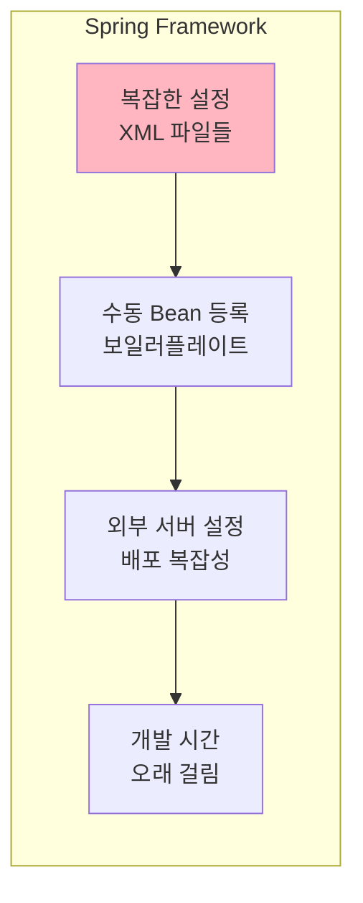

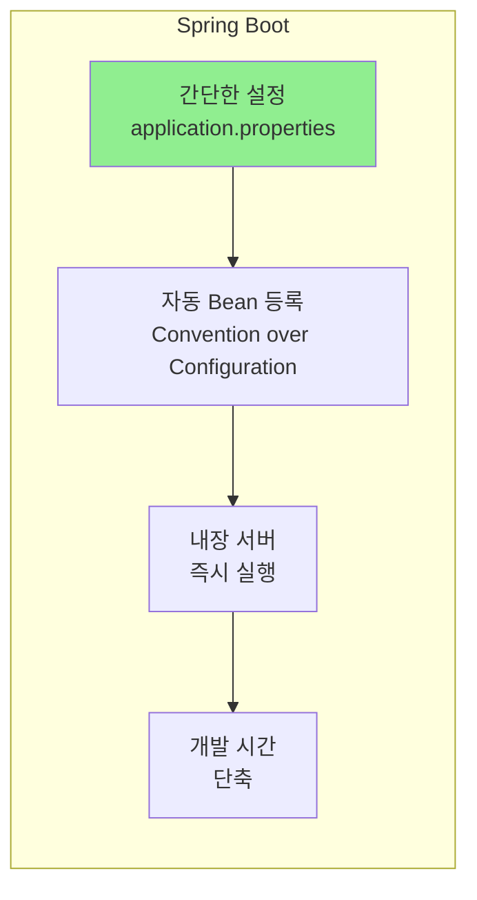

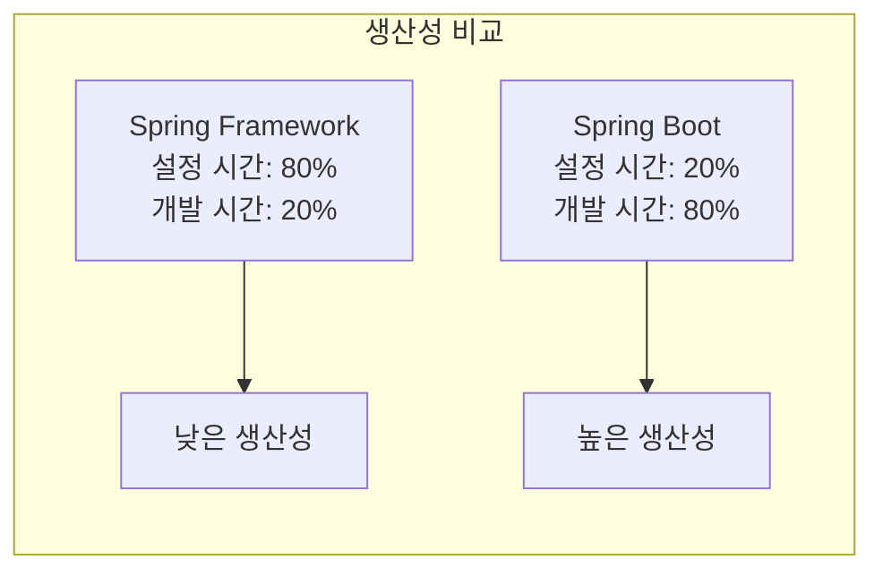

---

#### 6. 성능과 리소스 사용량 비교

**Spring Framework:**
- 외부 서버(Tomcat, JBoss 등) 필요
- 서버 시작 시간: 30초~2분
- 메모리 사용량: 서버 + 애플리케이션
- 배포 과정 복잡

**Spring Boot:**
- 내장 서버 사용
- 서버 시작 시간: 5~15초
- 메모리 사용량: 애플리케이션만
- 즉시 실행 가능

**성능 비교 다이어그램:**
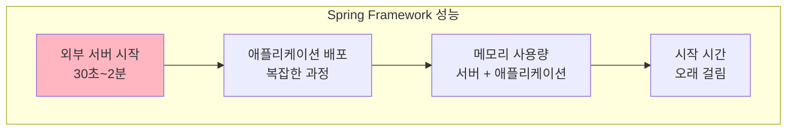

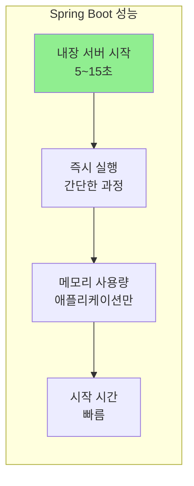

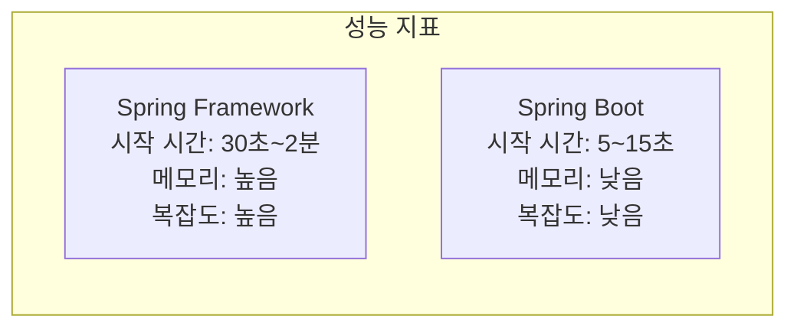

---

#### 7. 사용 시나리오 비교

| 구분 | Spring Framework | Spring Boot |
|------|------------------|-------------|
| **적합한 프로젝트** | 대규모 엔터프라이즈 애플리케이션 | 마이크로서비스, 프로토타입, 빠른 개발 |
| **설정 복잡도** | 높음 (수동 설정) | 낮음 (자동 설정) |
| **학습 곡선** | 가파름 | 완만함 |
| **유연성** | 높음 (세밀한 제어) | 중간 (Convention over Configuration) |
| **개발 속도** | 느림 | 빠름 |
| **배포 복잡도** | 높음 (외부 서버 필요) | 낮음 (JAR 파일 실행) |
| **성능** | 외부 서버 의존 | 내장 서버 사용 |
| **유지보수** | 복잡함 | 간단함 |

#### 8. 마이그레이션 전략

**Spring Framework → Spring Boot 마이그레이션:**
```java
// 1. 단계적 마이그레이션
// Phase 1: Spring Boot Starter 도입
<dependency>
    <groupId>org.springframework.boot</groupId>
    <artifactId>spring-boot-starter-web</artifactId>
</dependency>

// Phase 2: Auto-Configuration 활용
@SpringBootApplication
public class Application {
    public static void main(String[] args) {
        SpringApplication.run(Application.class, args);
    }
}

// Phase 3: 기존 XML 설정을 Java Config로 변환
@Configuration
public class LegacyConfig {
    // 기존 XML 설정을 Java Config로 변환
}
```

**마이그레이션 과정 다이어그램:**
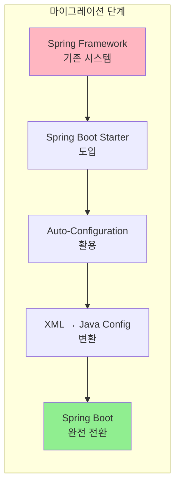


```mermaid
graph LR    
    subgraph "변환 과정"
        F[web.xml] --> G[@SpringBootApplication]
        H[applicationContext.xml] --> I[application.properties]
        J[dispatcher-servlet.xml] --> K[@EnableWebMvc]
    end
```

---

#### 결론 및 권장사항

**Spring Framework 사용 시기:**
- 대규모 엔터프라이즈 애플리케이션
- 세밀한 제어가 필요한 경우
- 기존 레거시 시스템과의 통합
- 특정 서버 환경에서 실행해야 하는 경우

**Spring Boot 사용 시기:**
- 마이크로서비스 개발
- 빠른 프로토타입 개발
- REST API 개발
- 독립 실행형 애플리케이션
- 클라우드 환경 배포

**실무 권장사항:**
1. **신규 프로젝트**: Spring Boot 우선 고려
2. **레거시 시스템**: 단계적 마이그레이션
3. **팀 역량**: Spring Boot 학습 비용 고려
4. **요구사항**: 프로젝트 특성에 맞는 선택

> **결론**: Spring Framework는 세밀한 제어와 유연성이 필요한 대규모 엔터프라이즈 애플리케이션에 적합하고, Spring Boot는 빠른 개발과 간편한 배포가 중요한 현대적인 애플리케이션 개발에 적합합니다. 프로젝트의 특성과 요구사항에 따라 적절한 선택이 필요합니다.
